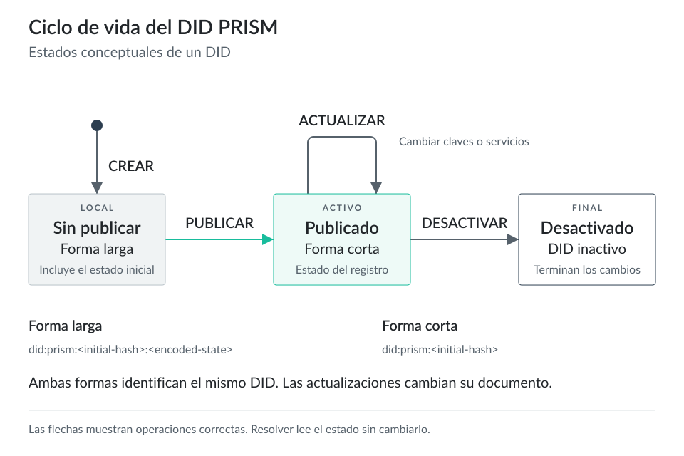
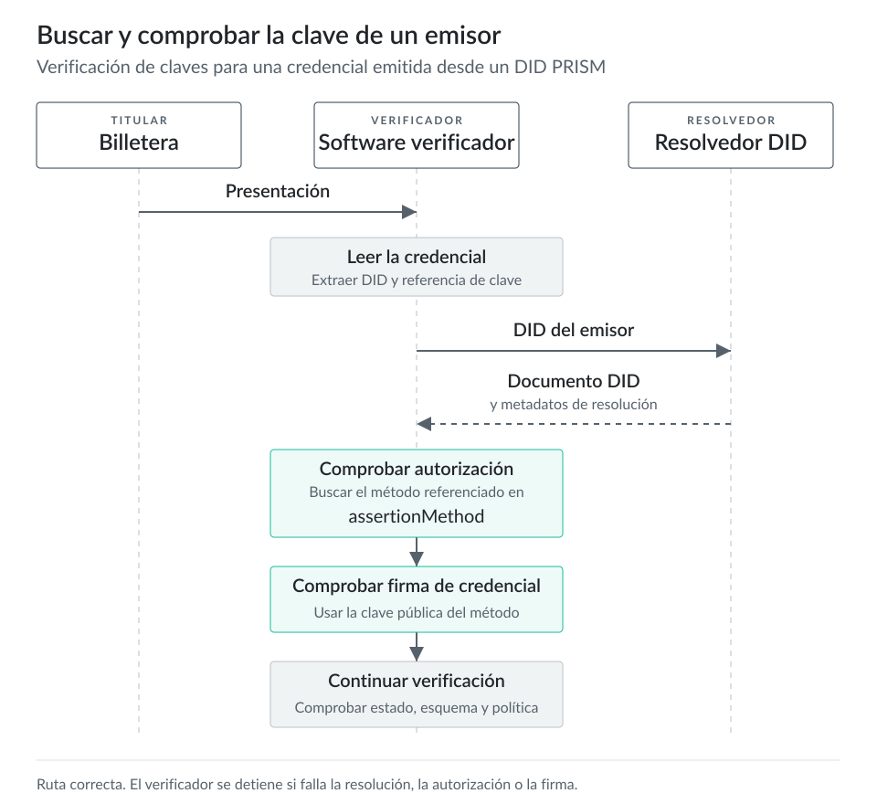

# DIDs y documentos DID {#sec-did-and-diddocuments}

## Descripción general

Un **identificador descentralizado (DID)** es una URI para un sujeto. El sujeto puede ser una persona, organización, dispositivo, agente de software, modelo de datos u otra entidad que elija el controlador del DID. La [especificación DID Core del W3C](https://www.w3.org/TR/did-1.0/) define un DID como una URI con tres partes: el esquema `did:`, un nombre de método y un identificador específico del método.

El DID en sí es solo el identificador. Un resolvedor resuelve el DID y devuelve un resultado de resolución. Si la resolución tiene éxito, el resultado incluye un **documento DID**, metadatos de resolución y metadatos del documento DID. La [especificación DID Resolution del W3C](https://www.w3.org/TR/did-resolution/) define esta interfaz del resolvedor y deja los pasos de obtención específicos al método DID.

Un **documento DID** publica la información pública que el software necesita para interactuar con el sujeto del DID: métodos de verificación, relaciones de verificación y servicios. Un documento DID debe excluir claves privadas, secretos y datos de perfiles personales. DID Core advierte que los documentos DID públicos pueden generar riesgos de privacidad y correlación. Por eso, los datos personales deben mantenerse en credenciales, intercambios entre pares o puntos de acceso de servicios controlados, fuera del documento público.

Los desarrolladores de Identus usan `did:prism` y `did:peer` para tareas distintas. `did:prism` sirve para las identidades públicas de emisores y verificadores que necesitan resolución respaldada por un libro mayor. `did:peer` sirve para las actividades DIDComm específicas de cada relación. Una billetera, un Cloud Agent o un mediador puede usar DIDs de pares distintos para reducir la correlación entre relaciones. La [documentación de administración de DIDs de Identus](https://hyperledger-identus.github.io/docs/home/identus/cloud-agent/did-management/) describe cómo Cloud Agent admite DIDs PRISM y DIDs de pares administrados.

## Sintaxis de los DIDs y métodos DID

La sintaxis genérica es:

```text
did:<method>:<method-specific-id>
```

Para `did:prism`, la [especificación del método DID PRISM](https://github.com/input-output-hk/prism-did-method-spec/blob/main/w3c-spec/PRISM-method.md) define esta estructura:

```text
did:prism:<initial-hash>[:<encoded-state>]
```

La forma corta contiene el prefijo `did:prism:` y un hash inicial de 64 caracteres. La forma larga añade el estado inicial codificado después de otros dos puntos. PRISM usa la forma larga antes de que el controlador ancle el DID. Cuando el controlador publica la operación DID y el VDR PRISM la acepta, el software puede usar la forma corta como DID PRISM publicado.

El estado codificado de un DID PRISM en forma larga no es un documento DID JSON. Es un estado específico del método que PRISM codifica para que un resolvedor pueda construir el documento DID inicial antes de que aparezca una operación pública de creación en el VDR.

Un **método DID** define cómo el software crea, resuelve, actualiza y desactiva DIDs y documentos DID para ese método. DID Core define el modelo de datos común. La especificación del método define el registro, las operaciones del protocolo, la codificación, las reglas de validación y el ciclo de vida.

Para `did:prism`, el método PRISM define operaciones de creación, actualización y desactivación. Los nodos PRISM leen las operaciones del VDR y mantienen el estado actual necesario para construir documentos DID. La [especificación del VDR PRISM](https://github.com/hyperledger-identus/prism-vdr-driver/blob/main/prism-vdr-specification.md) describe las entradas SSI como cadenas de eventos con eventos de creación, actualización y desactivación.

## Sujetos y controladores de DIDs

El DID identifica al sujeto. El método DID autoriza al controlador a cambiar el documento DID. Una misma entidad puede asumir ambos roles, aunque también pueden asumirlos entidades distintas.

Por ejemplo, una universidad puede ser el sujeto de `did:prism:...`. La universidad puede ejecutar un Identus Cloud Agent que guarde las claves del controlador y publique actualizaciones del DID mediante PRISM Node. La universidad sigue siendo el emisor en el intercambio de credenciales; el Cloud Agent constituye la infraestructura que actúa en su nombre.

La propiedad `controller` de nivel superior en un documento DID identifica uno o más DIDs de controladores. DID Core trata esta autorización por separado de `authentication`. Un verificador que comprueba una prueba de autenticación revisa la relación `authentication`. El software que procesa la autoridad para actualizar un DID sigue las reglas del controlador que define el método DID.

La propiedad `controller` dentro de un `verificationMethod` tiene otro alcance. Identifica al controlador de ese método de verificación. Puede coincidir con el `id` del documento DID o apuntar a otro DID cuando un sistema delega el control de claves.

## Estructura del documento DID

Los documentos DID comparten un modelo de datos y pueden tener distintas representaciones. Los ejemplos de DID Core y PRISM usan JSON-LD con `@context`; las representaciones JSON pueden omitir el contexto JSON-LD.

Estas son las propiedades habituales de un documento DID:

| Propiedad | Para qué la usa el software |
| --- | --- |
| `id` | El DID del sujeto que describe el documento DID. |
| `controller` | Uno o más DIDs con autorización para controlar el documento DID según las reglas del método DID. |
| `verificationMethod` | Material público de verificación, como JWK, junto con un `id`, un `type` y el controlador del método. |
| `authentication` | Métodos de verificación autorizados para autenticar al sujeto del DID mediante desafío y respuesta. |
| `assertionMethod` | Métodos de verificación autorizados para hacer afirmaciones, incluida la emisión de credenciales verificables. |
| `keyAgreement` | Métodos de verificación autorizados para el acuerdo de claves, incluida la preparación del cifrado DIDComm. |
| `capabilityInvocation` | Métodos de verificación autorizados para invocar capacidades de objetos. |
| `capabilityDelegation` | Métodos de verificación autorizados para delegar capacidades de objetos. |
| `service` | Puntos de acceso o descriptores de servicios para interactuar, como la mensajería DIDComm. |
| `@context` | Contexto JSON-LD que usan las representaciones JSON-LD. |

Una relación de verificación puede incluir métodos de verificación completos o referirse a ellos mediante una URL DID. Los ejemplos de PRISM definen cada método una sola vez en `verificationMethod` y lo referencian desde `authentication`, `assertionMethod` o `keyAgreement`.

## Ejemplo de documento DID PRISM

Este ejemplo usa valores ficticios y abreviados para que la estructura resulte fácil de leer. Estos identificadores y claves no son datos PRISM que puedas resolver.

```json
{
  "@context": [
    "https://www.w3.org/ns/did/v1",
    "https://w3id.org/security/suites/jws-2020/v1",
    "https://didcomm.org/messaging/contexts/v2"
  ],
  "id": "did:prism:example-university",
  "verificationMethod": [
    {
      "id": "did:prism:example-university#authentication-key-1",
      "type": "JsonWebKey2020",
      "controller": "did:prism:example-university",
      "publicKeyJwk": {
        "kty": "OKP",
        "crv": "Ed25519",
        "x": "fake-authentication-public-key"
      }
    },
    {
      "id": "did:prism:example-university#issuing-key-1",
      "type": "JsonWebKey2020",
      "controller": "did:prism:example-university",
      "publicKeyJwk": {
        "kty": "OKP",
        "crv": "Ed25519",
        "x": "fake-issuing-public-key"
      }
    },
    {
      "id": "did:prism:example-university#key-agreement-key-1",
      "type": "JsonWebKey2020",
      "controller": "did:prism:example-university",
      "publicKeyJwk": {
        "kty": "OKP",
        "crv": "X25519",
        "x": "fake-key-agreement-public-key"
      }
    }
  ],
  "authentication": [
    "did:prism:example-university#authentication-key-1"
  ],
  "assertionMethod": [
    "did:prism:example-university#issuing-key-1"
  ],
  "keyAgreement": [
    "did:prism:example-university#key-agreement-key-1"
  ],
  "service": [
    {
      "id": "did:prism:example-university#didcomm-1",
      "type": "DIDCommMessaging",
      "serviceEndpoint": [
        {
          "uri": "https://agent.example.edu/didcomm",
          "accept": ["didcomm/v2"],
          "routingKeys": ["did:peer:example-mediator#key-1"]
        }
      ]
    }
  ]
}
```

En el ejemplo, el software del emisor puede usar `#issuing-key-1` para firmar una credencial verificable, y un verificador puede comprobar que esa clave aparece en `assertionMethod`. Una implementación DIDComm puede usar `#key-agreement-key-1` para preparar mensajes cifrados y el servicio `DIDCommMessaging` para conocer el perfil DIDComm aceptado, la URI del punto de acceso y las claves de enrutamiento.

## Ciclo de vida del DID

Cada método DID define sus propias reglas de ciclo de vida. Las operaciones habituales son crear, resolver, actualizar y desactivar. Los desarrolladores de Identus acceden a esas operaciones mediante las API de Cloud Agent, las API de resolvedores, la configuración de resolvedores del SDK y el comportamiento de PRISM Node.

Para un DID PRISM administrado en Cloud Agent, el controlador crea el DID a partir de una plantilla de documento. Cloud Agent deriva el material de claves PRISM de una semilla de billetera y una ruta de derivación, guarda la ruta de derivación y puede reconstruir el material de claves a partir de la semilla durante la ejecución. La guía de inicio rápido de Identus crea un DID PRISM en forma larga, lo publica mediante Cloud Agent y luego usa la forma corta como `publishedPrismDID` para los flujos de esquemas y credenciales.

Las actualizaciones de PRISM publican operaciones del método que cambian el estado del DID, como añadir o eliminar métodos de verificación o servicios. La máquina de estados del VDR trata la desactivación como un estado final. Después de la desactivación, los resolvedores deben dejar de tratar al DID como activo.

::: {.content-visible when-format="html:js"}

:::

::: {.content-visible unless-format="html:js"}
{fig-alt="Ciclo de vida del DID PRISM"}
:::

Para un DID de pares administrado, Cloud Agent genera material de claves aleatorio y lo guarda en el almacenamiento de secretos. Los DIDs de pares no sirven como identificadores públicos globales de emisores. Sirven para las relaciones DIDComm y la mediación, donde cada relación puede usar identificadores y claves distintos.

## Resolvedores

Un resolvedor recibe un DID y devuelve el documento DID junto con sus metadatos. El resolvedor debe comprender el método DID. Un resolvedor genérico puede dirigir distintos métodos a drivers específicos, pero el driver de cada método sigue realizando la obtención y la validación propias de ese método.

Para `did:prism`, un resolvedor necesita el estado PRISM actual del DID. Identus documenta estas vías de resolución: Cloud Agent con PRISM Node, la compatibilidad de Universal Resolver con DIDs PRISM, la configuración de resolvedores del SDK e indexadores de la comunidad. La [documentación del resolvedor DID PRISM de Identus](https://hyperledger-identus.github.io/docs/home/identus/did-prism-resolver/) describe Cloud Agent y PRISM Node como una solución para crear, actualizar, desactivar y resolver DIDs PRISM.

La elección del resolvedor es una decisión de confianza. Un verificador puede usar un resolvedor alojado, ejecutar su propio resolvedor o resolver contra un estado indexado local. El software del verificador debe tratar la respuesta del resolvedor como una entrada de la verificación, no como toda la decisión de confianza. La verificación de credenciales sigue comprobando la prueba, la relación de verificación, el estado de la credencial, el esquema y la política del verificador.

## Controladores

Los controladores son entidades con autorización para cambiar el documento DID según las reglas del método DID. Un controlador puede ser una persona que usa una billetera, una organización que ejecuta Cloud Agent o un servicio bajo el control operativo de una organización. El documento DID registra a los controladores como DIDs; la autoridad legal o de gobernanza que respalda a esos controladores existe fuera del documento DID.

En `did:prism`, el controlador demuestra su autoridad mediante las operaciones firmadas del método. Las reglas de validación del VDR PRISM exigen que la clave maestra del DID firme las operaciones de creación y que una clave maestra vigente firme los eventos de actualización o desactivación. Las API de DIDs PRISM administrados de Cloud Agent realizan este trabajo de protocolo para la aplicación, pero el modelo de controladores sigue determinando quién puede rotar claves, añadir servicios o desactivar el DID.

## Flujo de verificación

Un verificador que comprueba una credencial emitida desde un DID PRISM usa este flujo.

1. El verificador recibe una presentación de la billetera o del Edge Agent del titular.
2. El verificador extrae el DID del emisor y el método de verificación que referencia la prueba de la credencial.
3. El resolvedor resuelve el DID del emisor y obtiene un documento DID.
4. El verificador obtiene el método de verificación referenciado y comprueba que aparece en `assertionMethod`.
5. El verificador comprueba la prueba criptográfica con la clave pública del método de verificación.
6. El verificador comprueba el estado de la credencial, el esquema y la política, incluida la confianza en el emisor para la transacción solicitada.

::: {.content-visible when-format="html:js"}

:::

::: {.content-visible unless-format="html:js"}
{fig-alt="Buscar y comprobar la clave de un emisor"}
:::

Las relaciones de verificación del DID impiden reutilizar claves para distintos fines de prueba. Una clave que solo aparece en `authentication` no puede emitir una credencial. Una clave que solo aparece en `assertionMethod` no puede participar en el acuerdo de claves de DIDComm. El software del verificador debe comprobar la relación que corresponde a la operación que valida.

## Comprobaciones de privacidad

Los DIDs públicos sirven para emisores, verificadores, esquemas y registros de confianza, pero generan correlación. El DID público de un emisor debe mantenerse estable para que los verificadores puedan resolver sus claves y los sistemas de políticas puedan referirse al emisor. La billetera de un titular debe usar DIDs por pares o específicos de cada relación para las conexiones DIDComm, salvo que el titular quiera permitir la correlación pública.

Antes de publicar un documento DID, el controlador debe comprobar que solo contiene el material público necesario para el método DID y los flujos del protocolo:

1. Excluir claves privadas, semillas, tokens de portador, credenciales y atributos de perfiles personales.
2. Excluir URL de puntos de acceso que incluyan un nombre de usuario, identificador de cliente, número de cuenta u otro valor que permita correlacionar actividades.
3. Evitar que las relaciones que deben mantenerse desvinculadas reutilicen un método de verificación.
4. Excluir propiedades `type` descriptivas o propiedades personalizadas que revelen la categoría del sujeto sin que el protocolo lo necesite.

Los DIDs se centran en la verificación pública y el enrutamiento. Las credenciales y las presentaciones contienen afirmaciones. Los agentes y las billeteras gestionan la divulgación a verificadores concretos.
