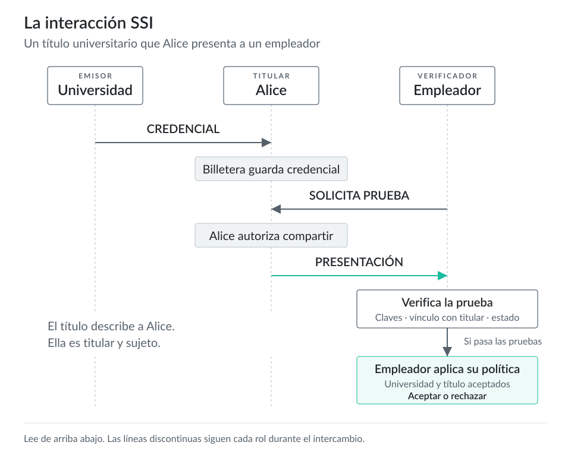

# Fundamentos de SSI {#sec-ssi-basics}

## Qué significa SSI en este libro

La identidad autosoberana (Self-Sovereign Identity, SSI) describe sistemas de identidad que usan credenciales en manos de sus titulares y pruebas verificables, en lugar de un único proveedor de identidad que guarda el perfil de la cuenta del usuario. Una persona, organización, dispositivo o agente de software puede recibir una credencial de un emisor, guardarla en una billetera o agente y presentar una prueba a un verificador. El verificador comprueba la prueba y aplica su propia política sin crear una integración de cuentas específica con cada emisor.

SSI no hace que las afirmaciones del titular sean confiables por sí solas. Un verificador comprueba quién emitió la credencial, qué afirma, si la prueba es válida, si la credencial sigue vigente y si acepta al emisor para esa transacción. SSI cambia la custodia y el intercambio de datos de identidad; la gobernanza, la ley, los contratos y la reputación siguen influyendo en las decisiones de confianza.

Este capítulo usa los términos de la [Recomendación del W3C sobre identificadores descentralizados (DIDs) v1.0](https://www.w3.org/TR/did-1.0/) y la [Recomendación del W3C sobre el modelo de datos de credenciales verificables v2.0](https://www.w3.org/TR/vc-data-model-2.0/). DID Core define los DIDs como identificadores de identidad digital verificable y descentralizada que pueden funcionar sin depender de registros centralizados, proveedores de identidad ni autoridades de certificación. El modelo de datos de VC define credenciales, presentaciones, emisores, titulares, sujetos y verificadores. La [guía de inicio rápido de Identus](https://identus.io/documentation/develop/quick-start/) describe Identus como bibliotecas centrales para las interacciones SSI entre emisores, titulares y verificadores.

## La interacción SSI

Un intercambio típico tiene cuatro pasos.

1. Un emisor hace afirmaciones sobre un sujeto y las reúne en una credencial.
2. Un titular recibe la credencial y la guarda en una billetera o agente.
3. Un verificador pide al titular una prueba que responda a una solicitud específica.
4. El titular devuelve la presentación y el verificador comprueba la criptografía, el estado y la política de negocio.

Ejemplo: una universidad emite una credencial de título académico a Alice. Alice recibe la credencial en su billetera y actúa como titular. El título describe a Alice, por lo que ella también es el sujeto. Un empleador actúa como verificador y pide una prueba de que Alice tiene un título en informática de una universidad acreditada. La billetera de Alice crea una presentación a partir de la credencial. El software del empleador comprueba que la universidad firmó la credencial, que Alice puede demostrar el control de las claves del titular que exige el formato de credencial, que el emisor no ha suspendido ni revocado la credencial y que la política de contratación del empleador acepta a esa universidad.

La evaluación de la política es validación. La verificación criptográfica puede demostrar que la clave de un emisor protegió la credencial y que nadie la modificó después de su emisión. No puede demostrar que el emisor sea aceptable para una decisión concreta. Un diploma de un proveedor de formación desconocido puede superar la verificación criptográfica y aun así incumplir la política del empleador. La especificación de VC del W3C describe la validación como la comprobación de reglas de negocio del verificador para determinar si una credencial resulta adecuada para un uso concreto.

::: {.content-visible when-format="html:js"}

:::

::: {.content-visible unless-format="html:js"}
{fig-alt="La interacción SSI"}
:::

## DIDs y documentos DID

Un identificador descentralizado (DID) es una URI. Incluye el esquema `did:`, un método DID y un identificador específico del método. En `did:prism:4a9bce8d72e4c30017c42f2b`, el método es `prism`; el último segmento contiene los datos del identificador que define ese método.

El método DID indica al software cómo crear, resolver, actualizar y desactivar esa clase de DID. DID Core no exige una tecnología de almacenamiento concreta. Un método DID puede usar un libro mayor distribuido, una base de datos, una red entre pares u otro registro de datos verificables, siempre que el método defina las operaciones necesarias.

Al resolver un DID, el software obtiene un documento DID. Los documentos DID expresan material público de verificación, relaciones de verificación y servicios. Un documento DID puede indicar al software qué claves públicas puede usar para autenticación, afirmación, acuerdo de claves, invocación de capacidades o delegación de capacidades. Puede enumerar puntos de acceso de servicios para protocolos de comunicación como DIDComm. Debe excluir secretos, claves privadas y perfiles personales.

El sujeto del DID y su controlador pueden ser la misma entidad, pero también pueden ser entidades distintas. El sujeto es la persona, organización, dispositivo, modelo de datos u otra cosa que identifica el DID. El controlador es la entidad que puede cambiar el documento DID según el método DID. El DID de una empresa puede identificar a la empresa como sujeto, y la empresa puede delegar las operaciones de claves a un Cloud Agent bajo su control.

Los DIDs pueden generar un riesgo de correlación. DID Core advierte que los identificadores inequívocos a escala global pueden vincular actividades entre contextos. Los DIDs por pares reducen ese riesgo al dar a cada relación su propio DID seudónimo. Aplica la misma revisión de privacidad a los documentos DID: las claves reutilizadas, los puntos de acceso poco comunes o las propiedades descriptivas también pueden vincular actividades entre relaciones.

## Credenciales verificables

Una credencial es un conjunto de afirmaciones de un emisor. Una credencial verificable (Verifiable Credential, VC) incluye un mecanismo de protección que permite al software detectar modificaciones y comprobar la autoría. La VC puede referirse a una persona, organización, dispositivo, cuenta, envío, artefacto de software o cualquier otro sujeto.

El emisor decide qué afirmar y firma la credencial o la protege con otro mecanismo. El titular guarda la credencial. El sujeto es la entidad que describen las afirmaciones. El titular y el sujeto suelen coincidir, pero no siempre. Una madre o un padre puede guardar una credencial sobre su hijo. Un representante de una empresa puede guardar una credencial sobre la empresa. Quien administra una flota de dispositivos puede guardar credenciales sobre esos dispositivos.

El modelo de datos y el formato de credencial son conceptos distintos. W3C VC 2.0 define el modelo. Las implementaciones pueden proteger y transportar credenciales mediante distintos formatos y protocolos. Los capítulos posteriores sobre Identus usan JWT-VC, SD-JWT-VC y AnonCreds en los flujos de implementación, por lo que la elección depende de los formatos de credencial que admitan los agentes y las billeteras de ese flujo.

La verificación en producción incluye el estado de la credencial. W3C VC 2.0 define `credentialStatus` para descubrir información de estado, como la suspensión o la revocación. Los detalles dependen del método de estado. Un verificador que acepta una credencial sin comprobar su estado puede aceptar una credencial que el emisor ya no respalda.

## Presentaciones verificables

Una presentación verificable (Verifiable Presentation, VP) contiene datos derivados de una o más credenciales que el titular comparte con un verificador concreto. Una presentación puede incluir una credencial, partes de una credencial o datos de varias credenciales, según el formato de credencial y el mecanismo de prueba.

Un titular usa presentaciones para responder a las solicitudes de los verificadores. El verificador pide los datos que necesita. La billetera muestra la solicitud al titular. El titular autoriza o rechaza la divulgación. La billetera crea entonces una presentación que se ajusta a la solicitud y al formato de credencial.

La divulgación selectiva depende del formato de credencial y del mecanismo de prueba. El modelo de datos de VC del W3C define la divulgación selectiva como la capacidad del titular para elegir con precisión qué compartir. La misma especificación recomienda minimizar los datos: los verificadores deben pedir la información mínima necesaria para una transacción. Un formato de credencial que admite divulgación selectiva puede permitir que Alice demuestre que tiene más de 21 años sin revelar su fecha de nacimiento completa. Un formato que carece de esa función puede exigir que comparta más datos.

## Los roles del triángulo de confianza

Las conversaciones sobre SSI suelen usar el «triángulo de confianza» para describir al emisor, al titular y al verificador. Considera el triángulo como roles en una interacción, no como etiquetas permanentes para personas u organizaciones.

Un emisor crea una credencial y asume la responsabilidad de sus afirmaciones. Un departamento de vehículos motorizados puede emitir una credencial de licencia de conducir. Una universidad puede emitir una credencial de título académico. Un gimnasio puede emitir una credencial de membresía. El emisor obtiene su autoridad del contexto: la ley, la acreditación, un contrato, las reglas de la comunidad, la reputación o la gobernanza.

Un titular recibe credenciales y crea presentaciones a partir de ellas. El titular puede ser una persona que usa una billetera móvil, una empresa que usa un Cloud Agent o software que administra credenciales para dispositivos. El control del titular significa que este decide si presenta una credencial en una interacción concreta, dentro de los límites del diseño de la billetera, el modelo de custodia, la ley y la política.

Un verificador recibe una presentación y decide si la acepta. La verificación suele comprobar la sintaxis, las pruebas criptográficas, las claves del emisor, la vinculación con el titular, el estado de la credencial y el esquema. La validación comprueba las reglas de negocio. Para un bar, puede bastar con «mayor de 21 años y credencial emitida por un departamento estatal de vehículos motorizados reconocido». Para la credencial de un empleado de hospital, el verificador puede necesitar comprobar el rol, el centro, el estado de la licencia y los registros de confianza.

Los roles dependen de la interacción. La misma entidad puede guardar una credencial, verificar otra y emitir una tercera.

## Registros de confianza y gobernanza

Un DID puede demostrar el control de claves. Una credencial puede demostrar que un emisor hizo una afirmación. El verificador todavía necesita decidir si ese emisor tiene la autoridad adecuada para su contexto. Los registros de confianza publican esa información de autorización para un ecosistema definido.

Trust over IP Foundation describe una consulta a un registro de confianza en términos sencillos: «¿Tiene la entidad X la autorización Y dentro del marco de gobernanza Z del ecosistema?». El [anuncio del protocolo de consultas a registros de confianza de ToIP v2.0](https://www.trustoverip.org/blog/2024/04/03/toip-announces-the-implementers-draft-of-thetrust-registry-protocol-specification-v2-0/) presenta TRQP como un mecanismo de solo lectura para descubrir quién tiene autorización para hacer qué dentro de un ecosistema de confianza digital. LF Decentralized Trust describe un registro de confianza como un sistema que conserva información autorizada que las partes que confían en ella usan para tomar decisiones de confianza.

Un registro de confianza no crea autoridad por sí solo. La autoridad procede del marco de gobernanza que lo respalda. Para una credencial inmobiliaria, el registro puede enumerar agentes con licencia y los tipos de credencial que pueden emitir o verificar. Para un título universitario, el registro puede enumerar instituciones acreditadas. Para una credencial de cadena de suministro, puede enumerar auditores que acepta un grupo industrial concreto.

Un verificador debe comprobar por separado la verificación técnica y la política de aceptación. La verificación comprueba pruebas, claves, sintaxis y estado. La política de aceptación comprueba si el emisor y el tipo de credencial cumplen las reglas de la parte que confía en ellos.

## Protocolos de intercambio

Los DIDs y las VC definen modelos de datos y material de verificación. Las aplicaciones también necesitan protocolos para intercambiar mensajes, emitir credenciales y solicitar presentaciones.

[DIDComm Messaging v2.1](https://identity.foundation/didcomm-messaging/spec/v2.1/) define formatos de mensajes cifrados que usan muchos sistemas SSI para la comunicación entre agentes. Los mensajes cifrados de DIDComm ocultan el contenido a quienes carecen de autorización, revelan y demuestran la identidad del remitente a los destinatarios autorizados en el modo autenticado, y garantizan la integridad. Identus usa DIDComm V2 para la comunicación entre Cloud Agents y para muchos flujos de agentes.

OpenID Foundation define protocolos basados en OAuth para el intercambio de credenciales. [OpenID4VCI 1.0](https://openid.net/specs/openid-4-verifiable-credential-issuance-1_0.html) define una API para emitir credenciales verificables. [OpenID4VP 1.0](https://openid.net/specs/openid-4-verifiable-presentations-1_0.html) define un protocolo para solicitar y presentar credenciales. Los ecosistemas de producción pueden admitir DIDComm, OpenID4VCI, OpenID4VP, transferencia mediante códigos QR, presentaciones sin conexión o una combinación de estas vías.

## Cómo se aplica esto a Identus

Identus ofrece componentes para estos roles SSI. El código de las aplicaciones puede usar agentes, SDK y API en lugar de volver a implementar el conjunto de estándares.

El [Identus Cloud Agent](https://identus.io/documentation/develop/quick-start/) puede emitir, guardar y verificar VC; administrar DIDs y conexiones basadas en DIDs; exponer una API REST; y usar DIDComm V2 para la comunicación entre agentes. Sus usos habituales incluyen billeteras con custodia, emisores empresariales, servicios de verificación y flujos de backend.

La [documentación de administración de DIDs de Identus](https://identus.io/documentation/develop/cloud-agent/did-management/) explica que Cloud Agent administra DIDs PRISM y DIDs de pares (Peer DIDs). Los DIDs PRISM sirven para la identidad pública del emisor y la resolución respaldada por un libro mayor. Los DIDs de pares sirven para las actividades DIDComm en las que los identificadores específicos de cada relación reducen la correlación.

La [guía de inicio rápido de Identus](https://identus.io/documentation/develop/quick-start/) describe PRISM Node como el componente de registro de datos verificables que ancla información de claves para la emisión y la verificación. También describe a los mediadores como servicios que guardan y retransmiten mensajes entre Cloud Agents y SDK de billeteras. PRISM Node admite la resolución pública de DIDs. Los mediadores retransmiten mensajes para agentes que carecen de conexión permanente, sin leer el contenido cifrado de DIDComm.

## Ideas clave para desarrolladores

SSI permite que emisores, titulares y verificadores intercambien afirmaciones con pruebas criptográficas y participación del titular. Los DIDs identifican y resuelven material de verificación. Los documentos DID publican claves públicas y servicios, y excluyen perfiles de identidad privados. Las credenciales verificables contienen afirmaciones del emisor. Las presentaciones verificables permiten que los titulares respondan a las solicitudes de los verificadores. La verificación comprueba pruebas y estado. La validación aplica políticas. Los registros de confianza y la gobernanza ayudan a los verificadores a decidir qué emisores y tipos de credencial aceptan en un ecosistema concreto.

En Identus, estos conceptos corresponden a componentes: PRISM Node para la resolución pública de DIDs, Cloud Agent para el trabajo de emisores, titulares y verificadores en servidores, SDK de Edge Agent para billeteras, DIDComm para mensajes seguros entre agentes y mediadores para el enrutamiento cuando los agentes de borde están sin conexión.
