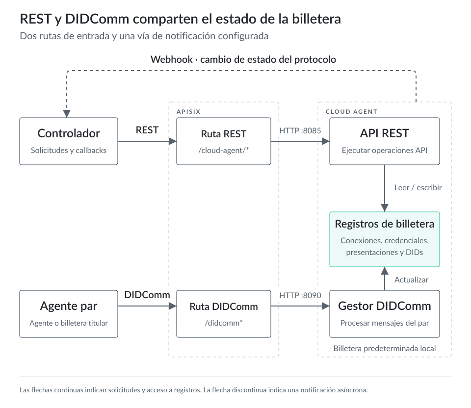
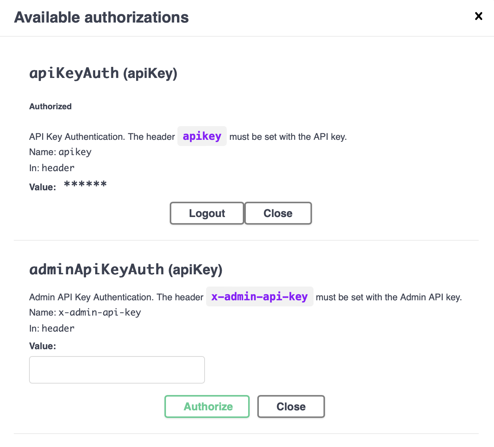

# API REST del agente {#sec-agent-rest-api}

## La API de Cloud Agent

Cloud Agent local expone dos interfaces públicas de protocolo mediante APISIX. Tu aplicación controladora usa la API REST para crear DIDs, registrar esquemas de credenciales, emitir credenciales verificables, administrar registros de conexión, solicitar presentaciones y consultar el estado del protocolo. Otros agentes y billeteras usan el punto de acceso DIDComm para entregar mensajes cifrados entre agentes.

Ambas interfaces comparten el mismo estado de billetera. Una solicitud REST modifica o lee registros de la billetera de Cloud Agent. Un mensaje DIDComm puede modificar esos mismos registros cuando Cloud Agent procesa un mensaje entrante de conexión, emisión o presentación. El [README de Cloud Agent](https://github.com/hyperledger-identus/cloud-agent/blob/main/README.md) describe este patrón como un controlador que envía solicitudes HTTP al agente y procesa las notificaciones webhook que este le envía.

::: {.content-visible when-format="html:js"}

:::

::: {.content-visible unless-format="html:js"}
{fig-alt="REST y DIDComm comparten el estado de la billetera"}
:::

El entorno local del capítulo anterior se ejecuta en modo de un solo inquilino. En ese modo, Cloud Agent usa la entidad predeterminada y la billetera predeterminada para las operaciones de la API REST y DIDComm. La [documentación de autenticación de Cloud Agent](https://github.com/hyperledger-identus/docs/blob/main/documentation/develop/cloud-agent/authentication.md#default-entity-and-wallet) define ambos identificadores como `00000000-0000-0000-0000-000000000000`.

Puedes confirmar la inicialización de la billetera predeterminada en los registros del contenedor:

```bash
docker logs local-cloud-agent-1 | grep "default"


... Initializing default wallet.
... Default wallet seed is not provided. New seed will be generated.
... Entity created: Entity(00000000-0000-0000-0000-000000000000,default,00000000-0000-0000-0000-000000000000,1970-01-01T00:00:00Z,1970-01-01T00:00:00Z)
```

Más adelante, la aplicación de ejemplo usará el modo de varios inquilinos. En ese modo, una instancia compartida de Cloud Agent atiende a varios inquilinos. La [documentación de varios inquilinos](https://github.com/hyperledger-identus/docs/blob/main/documentation/learn/advanced-explainers/cloud-agent/multi-tenancy.md) define una entidad como la representación del inquilino y una billetera como el contenedor aislado de sus DIDs, conexiones, credenciales, claves, esquemas de credenciales y activos relacionados. Una billetera administrada por el servicio sirve para un emisor, un verificador o un servicio de billeteras con custodia en el servidor, donde el operador administra la ejecución, la base de datos, el almacenamiento de secretos, el acceso a la API y las copias de seguridad.

El punto de acceso `_system/health` del capítulo anterior informa de la versión del servicio en ejecución. La API del sistema expone otro punto de acceso para las métricas de ejecución:

```bash
curl http://localhost/cloud-agent/_system/metrics
# HELP jvm_memory_bytes_used  
# TYPE jvm_memory_bytes_used gauge
jvm_memory_bytes_used{area="heap",} 1.07522616E8
jvm_memory_bytes_used{area="nonheap",} 1.74044936E8
...
```

La especificación OpenAPI de Cloud Agent describe el punto de acceso de métricas como una salida de texto Prometheus del registro interno de métricas. Úsalo cuando necesites datos de ejecución locales para investigar memoria, latencia o estado del servicio.

## Especificación OpenAPI

La especificación OpenAPI (`OAS`) es un formato estándar para describir API HTTP. Ofrece a personas y herramientas un contrato común para rutas, cuerpos de solicitud, cuerpos de respuesta, esquemas de autenticación y esquemas de datos. El repositorio de código de Cloud Agent incluye un documento OpenAPI 3.1 con el título `Identus Cloud Agent API Reference`. El entorno Docker local expone ese documento mediante APISIX.

Para el agente local que iniciaste en el capítulo anterior, usa esta URL como contrato de API que corresponde a esa versión:

```text
http://localhost/docs/cloud-agent/api/docs.yaml
```

Si iniciaste el agente con otro valor de `run.sh --port`, sustituye `localhost` por `localhost:<port>`. Swagger UI lee este mismo documento. Postman y los generadores de clientes pueden importarlo para crear una colección o un cliente auxiliar para la versión exacta de Cloud Agent que ejecutas.

La documentación alojada de Identus ofrece tutoriales actuales y conceptos en [https://hyperledger-identus.github.io/docs/](https://hyperledger-identus.github.io/docs/). Para trabajar con los puntos de acceso de este entorno local, usa de preferencia el documento OpenAPI que sirve tu agente en ejecución. Así evitas diferencias entre el libro, una página alojada y la versión de la imagen Docker.

## Pasarela APISIX

APISIX actúa como proxy de los servicios de Cloud Agent dentro del entorno Docker local. El script `run.sh` vincula APISIX al puerto que seleccionaste; el puerto predeterminado es `80`. La configuración APISIX compartida de Cloud Agent define estas rutas:

| Ruta local | Servicio de destino | Finalidad |
| --- | --- | --- |
| [http://localhost/cloud-agent/](http://localhost/cloud-agent/) | `cloud-agent:8085` | API REST para aplicaciones controladoras. |
| [http://localhost/docs/cloud-agent/api/docs.yaml](http://localhost/docs/cloud-agent/api/docs.yaml) | `cloud-agent:8085` | Documento OpenAPI del Cloud Agent en ejecución. |
| [http://localhost/apidocs/](http://localhost/apidocs/) | `swagger-ui:8080` | Swagger UI para llamadas interactivas a la API. |
| [http://localhost/didcomm/](http://localhost/didcomm/) | `cloud-agent:8090` | Punto de acceso público DIDComm para mensajes cifrados entre agentes. |

El punto de acceso DIDComm es el punto de transporte que anuncian las invitaciones y los documentos DID. Un par lo usa para enviar mensajes DIDComm cifrados a este Cloud Agent. El [capítulo sobre DIDComm](../section3/didcomm.md) explica el modelo de mensajes y el flujo del protocolo más adelante en el libro.

Las rutas de APISIX comparan las solicitudes entrantes con sus reglas, aplican los complementos de ruta y envían las solicitudes a los servicios de destino. La configuración local de Cloud Agent usa `proxy-rewrite` para eliminar el prefijo de ruta pública antes de enviar la solicitud, y habilita el complemento `cors` de APISIX en las rutas REST y DIDComm.

::: {.callout-warning}
La configuración local de CORS de APISIX permite todos los orígenes en las rutas `/cloud-agent/*` y `/didcomm*`. Esa configuración facilita las comprobaciones locales desde el navegador. Un servicio desplegado debe limitar los orígenes permitidos a los dominios que alojan la aplicación controladora, las herramientas de administración o las interfaces de billetera que necesitan acceso desde un navegador.
:::

## Swagger UI

[Swagger UI](https://swagger.io/tools/swagger-ui/) crea documentación de API y un formulario interactivo de solicitudes a partir de un documento OpenAPI. El entorno Docker local incluye un contenedor Swagger UI y APISIX lo expone en [http://localhost/apidocs/](http://localhost/apidocs/).

Abre [http://localhost/apidocs/](http://localhost/apidocs/) en tu navegador. En la lista de servidores, selecciona:

- `http://localhost/cloud-agent - The local instance of the Cloud Agent behind the APISIX proxy`.

Haz clic en `Authorize`. Swagger UI abre un cuadro de diálogo para la cabecera `apikey`. El entorno local desactiva la autenticación por clave de API de forma predeterminada, por lo que Cloud Agent acepta la solicitud aunque Swagger UI envíe cualquier valor. Por ahora, usa `test`. En capítulos posteriores, cuando el libro habilite la autenticación por clave de API, este campo debe contener la clave de API asignada a la entidad predeterminada o a la entidad del inquilino.

Después de autorizar, el cuadro de diálogo debe parecerse a este:



Cierra el cuadro de diálogo y prueba la primera solicitud. Expande `GET /connections` y haz clic en `Try it out`. Deja `offset`, `limit` y `thid` vacíos. Haz clic en `Execute` para enviar la solicitud.

La respuesta debe parecerse a esta:

```json
{ "contents": [], "kind": "ConnectionsPage", "self": "", "pageOf": "" }
```

Un array `contents` vacío indica que la billetera predeterminada todavía no tiene registros de conexión. Este es el resultado esperado para un agente local nuevo.

::: {.callout-note}
Swagger UI puede generar un comando `curl` para la solicitud que envía. Puedes pegarlo en tu terminal para ejecutar la misma llamada de API fuera del navegador. Por ejemplo:

```bash
curl -X 'GET' \
  'http://localhost/cloud-agent/connections' \
  -H 'accept: application/json' \
  -H 'apikey: test'
{"contents":[],"kind":"ConnectionsPage","self":"","pageOf":""}
```
:::

## Postman

Swagger UI sirve para comprobaciones rápidas con el agente en ejecución. Postman ofrece más opciones cuando necesitas entornos guardados, variables de solicitudes, aserciones mediante scripts, colecciones compartidas o comprobaciones manuales repetidas entre agentes emisores, titulares y verificadores.

Postman puede importar definiciones OpenAPI desde un archivo, una URL, texto YAML o JSON pegado, o un repositorio. Usa la URL OpenAPI del Cloud Agent local para que la colección corresponda a tu imagen Docker en ejecución.

1. Instala [Postman](https://www.postman.com/downloads/) si todavía no lo tienes.
2. Copia la URL OpenAPI local: `http://localhost/docs/cloud-agent/api/docs.yaml`. Si cambiaste el valor de `run.sh --port`, incluye ese puerto en la URL.
3. En Postman, ve a `File -> Import`.
4. Pega la URL OpenAPI en el cuadro de importación, o descarga el YAML desde esa URL e importa el archivo.
5. Importa la definición como una colección.

Después de importar, Postman debe mostrar una colección con el nombre `Identus Cloud Agent API Reference`. Si Postman no selecciona ese servidor, configura la URL base de la colección o la variable del servidor como `http://localhost/cloud-agent`.

## Tutoriales

Los [tutoriales oficiales de Identus](https://identus.io/cloud-agent/docs/docusaurus/) cubren los flujos principales de la API: conexiones, administración de DIDs, esquemas de credenciales, emisión de credenciales, solicitudes de presentación, webhooks, varios inquilinos e interacción con el VDR. Úsalos como referencia de los puntos de acceso para los próximos capítulos. Este libro conectará esas operaciones de API con la aplicación de ejemplo, el modelo de billetera, los flujos DIDComm y las comprobaciones de política del verificador.
