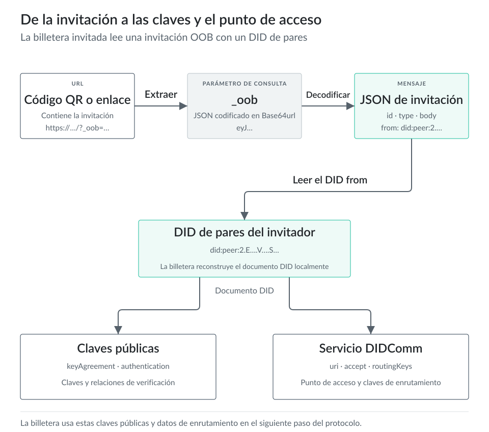
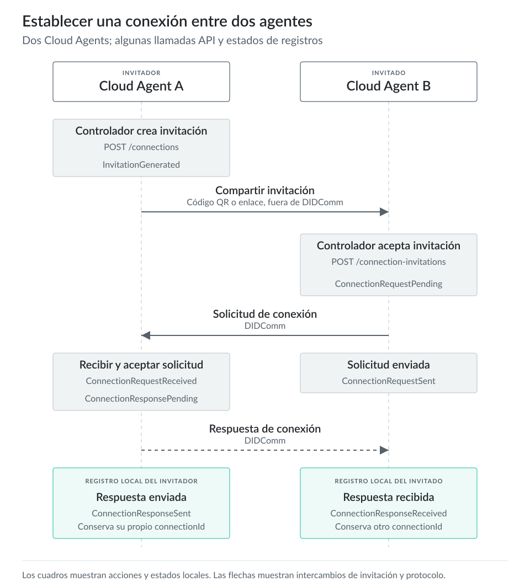

# Conexiones {#sec-connections}

## Descripción general

Ahora que comprendemos mejor las billeteras y los DIDs, podemos iniciar nuestra primera interacción. En este capítulo exploraremos qué significa una conexión en SSI, estudiaremos los DIDs de pares, explicaremos cómo funcionan y por qué son necesarios para conexiones seguras, analizaremos las invitaciones fuera de banda y mostraremos código de ejemplo para conectar un cliente Edge con un agente.

Antes de continuar, recomendamos leer al menos el [tutorial básico de conexiones](https://hyperledger.github.io/identus-docs/tutorials/connections/connection) de la [documentación oficial de Identus](https://hyperledger.github.io/identus-docs/).

## Conexiones en la identidad autosoberana

Las conexiones son fundamentales para establecer *interacciones de confianza* entre pares. Permiten una comunicación segura y verificable para que las entidades intercambien credenciales y pruebas de forma descentralizada. Esta relación usa un estándar específico de identificadores descentralizados (**DID de pares**) y un protocolo (**DIDComm**) que garantiza la autenticidad, la integridad y la privacidad de las interacciones entre las partes conectadas.

Una conexión SSI tiene tres roles:

- **Invitador**: la entidad que inicia la conexión mediante una invitación.
- **Invitado**: la entidad que recibe la invitación y responde con una solicitud de conexión.
- **Mediador**: un intermediario que facilita la entrega de mensajes entre entidades, especialmente cuando una o ambas partes no están siempre conectadas.

::: {.callout-note}
El capítulo sobre [mediadores](../section2/mediator.md) los explica en detalle. Por ahora, debes comprender que prestan un servicio de retransmisión de mensajes entre pares. Almacenan mensajes y los entregan cuando un par vuelve a conectarse, se conecta al mediador y recupera sus mensajes.
:::

## DIDs de pares

Son un tipo especial de identificador descentralizado con propiedades que los hacen adecuados para establecer comunicaciones privadas y seguras entre pares.

Los documentos DID, como los de DIDs PRISM, deben estar disponibles públicamente y permitir que cualquier parte los resuelva. Por ello, almacenarlos en un VDR como la cadena de bloques Cardano permite cumplir este requisito de forma fiable.

Sin embargo, cuando Alice y Bob quieren interactuar, solo dos partes necesitan los detalles de esa conexión: Alice y Bob. Solo ellos necesitan resolver sus DIDs. Por tanto, los DIDs de pares describen un par de claves para cifrar y firmar datos que Alice y Bob envían y reciben mediante sus mediadores preferidos. Por ejemplo, cuando Alice acepta una invitación de Bob e inician el protocolo de conexión, Alice genera un DID de pares que le permite cifrar y firmar datos dirigidos mediante el mediador de Bob (mediador Y) que solo Bob puede descifrar. A su vez, Bob genera un DID de pares que le permite cifrar y firmar datos dirigidos mediante el mediador preferido de Alice (mediador X) que solo Alice puede descifrar.

Las principales ventajas de los DIDs de pares son:

1. Son descentralizados por naturaleza.
2. No tienen coste de transacción en la cadena de bloques.
3. Son privados: solo las partes implicadas los conocen.
4. Permiten su reutilización sin depender de internet y sin degradar la confianza. Siguen los principios de [prioridad local](https://www.inkandswitch.com/local-first/) y [prioridad sin conexión](https://offlinefirst.org).

Resolvamos un DID de pares. Llamamos resolución al desempaquetado y análisis de un DID para leer su contenido y usarlo en las interacciones necesarias. En este ejemplo resolveremos el DID de pares del mediador Identus local que iniciaste en el capítulo sobre [mediadores](../section2/mediator.md), que escucha en `http://localhost:8080`.

```bash
curl http://localhost:8080/did

did:peer:2.Ez6LSghwSE437wnDE1pt3X6hVDUQzSjsHzinpX3XFvMjRAm7y.Vz6Mkhh1e5CEYYq6JBUcTZ6Cp2ranCWRrv7Yax3Le4N59R6dd.SeyJ0IjoiZG0iLCJzIjp7InVyaSI6Imh0dHA6Ly9sb2NhbGhvc3Q6ODA4MCIsImEiOlsiZGlkY29tbS92MiJdfX0.SeyJ0IjoiZG0iLCJzIjp7InVyaSI6IndzOi8vbG9jYWxob3N0OjgwODAvd3MiLCJhIjpbImRpZGNvbW0vdjIiXX19
```

El mediador devuelve un DID de pares cuando enviamos una solicitud `GET` al punto de acceso `/did`. Un DID `did:peer:2` contiene toda la información necesaria: las claves y los puntos de acceso de servicios están codificados en la propia cadena DID. Por tanto, puede resolverse localmente sin contactar con una red o registro. Aquí usamos la biblioteca Python [`did-peer-2`](https://pypi.org/project/did-peer-2/), una de las implementaciones de la especificación del método Peer DID.

```bash
pip install did-peer-2
python3 -c "import json, sys; from did_peer_2 import resolve; print(json.dumps(resolve(sys.argv[1]), indent=2))" \
  "$(curl -s http://localhost:8080/did)"
```
```json
{
  "@context": [
    "https://www.w3.org/ns/did/v1",
    "https://w3id.org/security/multikey/v1"
  ],
  "id": "did:peer:2.Ez6LSghwSE437wnDE1pt3X6hVDUQzSjsHzinpX3XFvMjRAm7y.Vz6Mkhh1e5CEYYq6JBUcTZ6Cp2ranCWRrv7Yax3Le4N59R6dd.SeyJ0IjoiZG0iLCJzIjp7InVyaSI6Imh0dHA6Ly9sb2NhbGhvc3Q6ODA4MCIsImEiOlsiZGlkY29tbS92MiJdfX0.SeyJ0IjoiZG0iLCJzIjp7InVyaSI6IndzOi8vbG9jYWxob3N0OjgwODAvd3MiLCJhIjpbImRpZGNvbW0vdjIiXX19",
  "verificationMethod": [
    {
      "type": "Multikey",
      "id": "#key-1",
      "controller": "did:peer:2.Ez6LSghwSE437wnDE1pt3X6hVDUQzSjsHzinpX3XFvMjRAm7y.Vz6Mkhh1e5CEYYq6JBUcTZ6Cp2ranCWRrv7Yax3Le4N59R6dd.SeyJ0IjoiZG0iLCJzIjp7InVyaSI6Imh0dHA6Ly9sb2NhbGhvc3Q6ODA4MCIsImEiOlsiZGlkY29tbS92MiJdfX0.SeyJ0IjoiZG0iLCJzIjp7InVyaSI6IndzOi8vbG9jYWxob3N0OjgwODAvd3MiLCJhIjpbImRpZGNvbW0vdjIiXX19",
      "publicKeyMultibase": "z6LSghwSE437wnDE1pt3X6hVDUQzSjsHzinpX3XFvMjRAm7y"
    },
    {
      "type": "Multikey",
      "id": "#key-2",
      "controller": "did:peer:2.Ez6LSghwSE437wnDE1pt3X6hVDUQzSjsHzinpX3XFvMjRAm7y.Vz6Mkhh1e5CEYYq6JBUcTZ6Cp2ranCWRrv7Yax3Le4N59R6dd.SeyJ0IjoiZG0iLCJzIjp7InVyaSI6Imh0dHA6Ly9sb2NhbGhvc3Q6ODA4MCIsImEiOlsiZGlkY29tbS92MiJdfX0.SeyJ0IjoiZG0iLCJzIjp7InVyaSI6IndzOi8vbG9jYWxob3N0OjgwODAvd3MiLCJhIjpbImRpZGNvbW0vdjIiXX19",
      "publicKeyMultibase": "z6Mkhh1e5CEYYq6JBUcTZ6Cp2ranCWRrv7Yax3Le4N59R6dd"
    }
  ],
  "keyAgreement": [
    "#key-1"
  ],
  "authentication": [
    "#key-2"
  ],
  "service": [
    {
      "type": "DIDCommMessaging",
      "serviceEndpoint": {
        "uri": "http://localhost:8080",
        "accept": [
          "didcomm/v2"
        ]
      },
      "id": "#service"
    },
    {
      "type": "DIDCommMessaging",
      "serviceEndpoint": {
        "uri": "ws://localhost:8080/ws",
        "accept": [
          "didcomm/v2"
        ]
      },
      "id": "#service-1"
    }
  ],
  "alsoKnownAs": [
    "did:peer:3zQmdayqvm5GBi2QrjAz3y99vCEp7xMvcz8eDLi1KefSq38f"
  ]
}
```

Así se ve un DID de pares resuelto en su documento DID. La entrada `alsoKnownAs` contiene el identificador equivalente de forma corta `did:peer:3`, derivado del mismo DID.

En términos simples, un DID de pares es una carga útil JSON que contiene un conjunto de claves y puntos de acceso de servicios opcionales. Como este es el DID de pares de un mediador, contiene puntos de acceso para `DIDCommMessaging`. En este caso contiene dos: uno mediante `http` y otro mediante `websockets`. Estos valores proceden de la configuración `SERVICE_ENDPOINTS` del mediador.

Para profundizar en los DIDs de pares, consulta la [especificación completa del método Peer DID](https://identity.foundation/peer-did-method-spec). En el momento de escribir este texto, el ecosistema Hyperledger Identus solo admite DIDs de pares del método 2.

## Invitaciones fuera de banda

Las invitaciones fuera de banda (OOB) son el punto de entrada de algunos protocolos. Normalmente se codifican en una carga útil JSON o una URL y se distribuyen fuera de banda, habitualmente mediante códigos QR, aunque pueden usar cualquier medio, como Bluetooth o NFC. Reúnen toda la información necesaria para que un par empiece a interactuar con otro. Puedes considerarlas una forma de anunciar las «coordenadas» del invitador a cualquiera que quiera establecer una interacción con él.

En el mismo ejemplo anterior, el mediador local también proporciona una invitación OOB como URL mediante su punto de acceso `/invitationOOB`.

```bash
curl http://localhost:8080/invitationOOB

?_oob=eyJpZCI6IjA4NzQ3YWJiLTE4MGYtNGQxOC05ZTVjLWIzOGRiM2JiMTJhMiIsInR5cGUiOiJodHRwczovL2RpZGNvbW0ub3JnL291dC1vZi1iYW5kLzIuMC9pbnZpdGF0aW9uIiwiZnJvbSI6ImRpZDpwZWVyOjIuRXo2TFNnaHdTRTQzN3duREUxcHQzWDZoVkRVUXpTanNIemlucFgzWEZ2TWpSQW03eS5WejZNa2hoMWU1Q0VZWXE2SkJVY1RaNkNwMnJhbkNXUnJ2N1lheDNMZTRONTlSNmRkLlNleUowSWpvaVpHMGlMQ0p6SWpwN0luVnlhU0k2SW1oMGRIQTZMeTlzYjJOaGJHaHZjM1E2T0RBNE1DSXNJbUVpT2xzaVpHbGtZMjl0YlM5Mk1pSmRmWDAuU2V5SjBJam9pWkcwaUxDSnpJanA3SW5WeWFTSTZJbmR6T2k4dmJHOWpZV3hvYjNOME9qZ3dPREF2ZDNNaUxDSmhJanBiSW1ScFpHTnZiVzB2ZGpJaVhYMTkiLCJib2R5Ijp7ImdvYWxfY29kZSI6InJlcXVlc3QtbWVkaWF0ZSIsImdvYWwiOiJSZXF1ZXN0TWVkaWF0ZSIsImFjY2VwdCI6WyJkaWRjb21tL3YyIl19fQ
```

Al añadirla a la URL del mediador, se obtiene un enlace completo de invitación como `http://localhost:8080?_oob=eyJpZC...`.

Si decodificamos desde `base64` el valor de la variable de consulta `_oob`, obtenemos la carga útil `json`:

```json
{
  "id": "08747abb-180f-4d18-9e5c-b38db3bb12a2",
  "type": "https://didcomm.org/out-of-band/2.0/invitation",
  "from": "did:peer:2.Ez6LSghwSE437wnDE1pt3X6hVDUQzSjsHzinpX3XFvMjRAm7y.Vz6Mkhh1e5CEYYq6JBUcTZ6Cp2ranCWRrv7Yax3Le4N59R6dd.SeyJ0IjoiZG0iLCJzIjp7InVyaSI6Imh0dHA6Ly9sb2NhbGhvc3Q6ODA4MCIsImEiOlsiZGlkY29tbS92MiJdfX0.SeyJ0IjoiZG0iLCJzIjp7InVyaSI6IndzOi8vbG9jYWxob3N0OjgwODAvd3MiLCJhIjpbImRpZGNvbW0vdjIiXX19",
  "body": {
    "goal_code": "request-mediate",
    "goal": "RequestMediate",
    "accept": [
      "didcomm/v2"
    ]
  }
}
```

Una invitación fuera de banda es una forma de empaquetar un DID de pares e indicar que puede usarse para una interacción concreta. En este caso, para un objetivo `RequestMediate` mediante `DIDComm`.

Como recordatorio, un DID de pares empaqueta un conjunto de claves y puntos de acceso de servicios opcionales. Por tanto, *como esta es una invitación OOB de un mediador*, contiene todo lo que necesitas —un DID de pares y un conjunto de puntos de acceso de servicios— para establecer este servicio como tu mediador.

::: {.content-visible when-format="html:js"}

:::

::: {.content-visible unless-format="html:js"}
{fig-alt="De la invitación a las claves y el punto de acceso"}
:::

## Conectar dos pares

Emitamos ahora otro tipo de invitación fuera de banda, desde Cloud Agent, para establecer una conexión.

Cloud Agent puede generar invitaciones fuera de banda. Otro par, como otro Cloud Agent o un cliente Edge, puede analizar la invitación y usarla para establecer una conexión. El resultado debe ser un DID de pares en cada lado que les permita enviarse mensajes mediante `DIDComm`.

::: {.content-visible when-format="html:js"}

:::

::: {.content-visible unless-format="html:js"}
{fig-alt="Establecer una conexión entre dos agentes"}
:::

Nuestro primer paso consiste en generar la invitación:

```bash
curl --location 'http://127.0.0.1:8080/cloud-agent/connections' \
--header 'Content-Type: application/json' \
--header 'Accept: application/json' \
--data '{"label": "test"}'
```

::: {.callout-note}
El único parámetro que podemos cambiar al generar una invitación es `label`. Es opcional y contiene una cadena simple que puedes usar para identificar la conexión después. Puedes usar un `uuid` que generas y administras en tus sistemas, un alias o el motivo de la conexión. La elección depende de la interacción y el caso de uso; aquí usaremos «test».
:::

Cloud Agent responderá con una carga útil similar a esta:

```json
{
    "connectionId": "fb36eddd-d51e-42cf-a6fe-e76d2e638b70",
    "thid": "fb36eddd-d51e-42cf-a6fe-e76d2e638b70",
    "label": "test",
    "role": "Inviter",
    "state": "InvitationGenerated",
    "invitation": {
        "id": "fb36eddd-d51e-42cf-a6fe-e76d2e638b70",
        "type": "https://didcomm.org/out-of-band/2.0/invitation",
        "from": "did:peer:2.Ez6LSgY6Y67mJ75YCZfZYxYEPQJZs3vaEg2Cc91vppoTA7cpj.Vz6MkpX7H7SNA6ooG5snn2MzgyoRadEZtsjNSL1x7HiiLkqyV.SeyJ0IjoiZG0iLCJzIjp7InVyaSI6Imh0dHA6Ly9ob3N0LmRvY2tlci5pbnRlcm5hbDo4MDgwL2RpZGNvbW0iLCJyIjpbXSwiYSI6WyJkaWRjb21tL3YyIl19fQ",
        "invitationUrl": "https://my.domain.com/path?_oob=eyJpZCI6ImZiMzZlZGRkLWQ1MWUtNDJjZi1hNmZlLWU3NmQyZTYzOGI3MCIsInR5cGUiOiJodHRwczovL2RpZGNvbW0ub3JnL291dC1vZi1iYW5kLzIuMC9pbnZpdGF0aW9uIiwiZnJvbSI6ImRpZDpwZWVyOjIuRXo2TFNnWTZZNjdtSjc1WUNaZlpZeFlFUFFKWnMzdmFFZzJDYzkxdnBwb1RBN2Nwai5WejZNa3BYN0g3U05BNm9vRzVzbm4yTXpneW9SYWRFWnRzak5TTDF4N0hpaUxrcXlWLlNleUowSWpvaVpHMGlMQ0p6SWpwN0luVnlhU0k2SW1oMGRIQTZMeTlvYjNOMExtUnZZMnRsY2k1cGJuUmxjbTVoYkRvNE1EZ3dMMlJwWkdOdmJXMGlMQ0p5SWpwYlhTd2lZU0k2V3lKa2FXUmpiMjF0TDNZeUlsMTlmUSIsImJvZHkiOnsiYWNjZXB0IjpbXX19"
    },
    "createdAt": "2025-01-04T12:37:37.059649293Z",
    "metaRetries": 5,
    "self": "fb36eddd-d51e-42cf-a6fe-e76d2e638b70",
    "kind": "Connection"
}
```

Después de crear la invitación de conexión, puedes obtener sus detalles mediante una solicitud `GET` con el `connectionId`:

```bash
curl --location 'http://127.0.0.1:8080/cloud-agent/connections/fb36eddd-d51e-42cf-a6fe-e76d2e638b70' \
--header 'Accept: application/json' \
```

Debes recibir la misma carga útil que al crearla, salvo que haya cambiado algún dato, como `state`:

```json
{
    "connectionId": "fb36eddd-d51e-42cf-a6fe-e76d2e638b70",
    "thid": "fb36eddd-d51e-42cf-a6fe-e76d2e638b70",
    "label": "test",
    "role": "Inviter",
    "state": "InvitationGenerated",
    "invitation": {
        "id": "fb36eddd-d51e-42cf-a6fe-e76d2e638b70",
        "type": "https://didcomm.org/out-of-band/2.0/invitation",
        "from": "did:peer:2.Ez6LSgY6Y67mJ75YCZfZYxYEPQJZs3vaEg2Cc91vppoTA7cpj.Vz6MkpX7H7SNA6ooG5snn2MzgyoRadEZtsjNSL1x7HiiLkqyV.SeyJ0IjoiZG0iLCJzIjp7InVyaSI6Imh0dHA6Ly9ob3N0LmRvY2tlci5pbnRlcm5hbDo4MDgwL2RpZGNvbW0iLCJyIjpbXSwiYSI6WyJkaWRjb21tL3YyIl19fQ",
        "invitationUrl": "https://my.domain.com/path?_oob=eyJpZCI6ImZiMzZlZGRkLWQ1MWUtNDJjZi1hNmZlLWU3NmQyZTYzOGI3MCIsInR5cGUiOiJodHRwczovL2RpZGNvbW0ub3JnL291dC1vZi1iYW5kLzIuMC9pbnZpdGF0aW9uIiwiZnJvbSI6ImRpZDpwZWVyOjIuRXo2TFNnWTZZNjdtSjc1WUNaZlpZeFlFUFFKWnMzdmFFZzJDYzkxdnBwb1RBN2Nwai5WejZNa3BYN0g3U05BNm9vRzVzbm4yTXpneW9SYWRFWnRzak5TTDF4N0hpaUxrcXlWLlNleUowSWpvaVpHMGlMQ0p6SWpwN0luVnlhU0k2SW1oMGRIQTZMeTlvYjNOMExtUnZZMnRsY2k1cGJuUmxjbTVoYkRvNE1EZ3dMMlJwWkdOdmJXMGlMQ0p5SWpwYlhTd2lZU0k2V3lKa2FXUmpiMjF0TDNZeUlsMTlmUSIsImJvZHkiOnsiYWNjZXB0IjpbXX19"
    },
    "createdAt": "2025-01-04T12:37:37.059649Z",
    "metaRetries": 5,
    "self": "fb36eddd-d51e-42cf-a6fe-e76d2e638b70",
    "kind": "Connection"
}
```

Veamos qué representa esta carga útil.

La carga útil de la invitación contiene metadatos importantes:

- **connectionId**: el identificador único del recurso de conexión, que permite obtener los detalles de la conexión.
- **thid**: el identificador único del *hilo* al que pertenece este registro de conexión. El valor será idéntico en ambos lados de la conexión, invitador e invitado.
- **label**: un alias legible de la conexión.
- **role**: el rol de Cloud Agent en esta conexión, `Inviter` o `Invitee`.
- **state**: el estado actual de la conexión. Depende del rol de Cloud Agent. Para `Inviter`, los estados pueden ser `InvitationGenerated`, `ConnectionRequestReceived`, `ConnectionResponsePending` y `ConnectionResponseSent`. Cloud Agent también puede analizar la invitación de otra parte. En ese caso, genera una conexión con el rol `Invitee`, cuyos estados posibles son `InvitationReceived`, `ConnectionRequestPending`, `ConnectionRequestSent` y `ConnectionResponseReceived`.
- **invitation**: los detalles de la invitación `DIDComm`.
- **createdAt**: fecha y hora de creación o recepción de esta conexión.
- **metaRetries**: el número máximo de intentos restantes de procesamiento en segundo plano para este registro.
- **self**: la referencia al recurso de conexión.
- **kind**: el tipo de objeto devuelto. En este caso, `Connection`.

Analicemos los detalles de `invitation`.

- **id**: el identificador único de la invitación. Debe usarse como identificador del hilo padre (`pthid`) del siguiente mensaje de solicitud de conexión.
- **type**: el URI de tipo de mensaje DIDComm (MTURI) al que corresponde el mensaje de invitación.
- **from**: el DID que representa al remitente y que los destinatarios usarán en interacciones posteriores.
- **invitationUrl**: el mensaje de invitación codificado como URL.

Resolvamos el DID `from`:

```bash
curl https://dev.uniresolver.io/1.0/identifiers/did:peer:2.Ez6LSgY6Y67mJ75YCZfZYxYEPQJZs3vaEg2Cc91vppoTA7cpj.Vz6MkpX7H7SNA6ooG5snn2MzgyoRadEZtsjNSL1x7HiiLkqyV.SeyJ0IjoiZG0iLCJzIjp7InVyaSI6Imh0dHA6Ly9ob3N0LmRvY2tlci5pbnRlcm5hbDo4MDgwL2RpZGNvbW0iLCJyIjpbXSwiYSI6WyJkaWRjb21tL3YyIl19fQ
```
```json
{
  "@context": "https://w3id.org/did-resolution/v1",
  "didDocument": {
    "@context": [
      "https://www.w3.org/ns/did/v1",
      "https://w3id.org/security/multikey/v1",
      {
        "@base": "did:peer:2.Ez6LSgY6Y67mJ75YCZfZYxYEPQJZs3vaEg2Cc91vppoTA7cpj.Vz6MkpX7H7SNA6ooG5snn2MzgyoRadEZtsjNSL1x7HiiLkqyV.SeyJ0IjoiZG0iLCJzIjp7InVyaSI6Imh0dHA6Ly9ob3N0LmRvY2tlci5pbnRlcm5hbDo4MDgwL2RpZGNvbW0iLCJyIjpbXSwiYSI6WyJkaWRjb21tL3YyIl19fQ"
      }
    ],
    "id": "did:peer:2.Ez6LSgY6Y67mJ75YCZfZYxYEPQJZs3vaEg2Cc91vppoTA7cpj.Vz6MkpX7H7SNA6ooG5snn2MzgyoRadEZtsjNSL1x7HiiLkqyV.SeyJ0IjoiZG0iLCJzIjp7InVyaSI6Imh0dHA6Ly9ob3N0LmRvY2tlci5pbnRlcm5hbDo4MDgwL2RpZGNvbW0iLCJyIjpbXSwiYSI6WyJkaWRjb21tL3YyIl19fQ",
    "verificationMethod": [
      {
        "id": "#key-2",
        "type": "Multikey",
        "controller": "did:peer:2.Ez6LSgY6Y67mJ75YCZfZYxYEPQJZs3vaEg2Cc91vppoTA7cpj.Vz6MkpX7H7SNA6ooG5snn2MzgyoRadEZtsjNSL1x7HiiLkqyV.SeyJ0IjoiZG0iLCJzIjp7InVyaSI6Imh0dHA6Ly9ob3N0LmRvY2tlci5pbnRlcm5hbDo4MDgwL2RpZGNvbW0iLCJyIjpbXSwiYSI6WyJkaWRjb21tL3YyIl19fQ",
        "publicKeyMultibase": "z6MkpX7H7SNA6ooG5snn2MzgyoRadEZtsjNSL1x7HiiLkqyV"
      },
      {
        "id": "#key-1",
        "type": "Multikey",
        "controller": "did:peer:2.Ez6LSgY6Y67mJ75YCZfZYxYEPQJZs3vaEg2Cc91vppoTA7cpj.Vz6MkpX7H7SNA6ooG5snn2MzgyoRadEZtsjNSL1x7HiiLkqyV.SeyJ0IjoiZG0iLCJzIjp7InVyaSI6Imh0dHA6Ly9ob3N0LmRvY2tlci5pbnRlcm5hbDo4MDgwL2RpZGNvbW0iLCJyIjpbXSwiYSI6WyJkaWRjb21tL3YyIl19fQ",
        "publicKeyMultibase": "z6LSgY6Y67mJ75YCZfZYxYEPQJZs3vaEg2Cc91vppoTA7cpj"
      }
    ],
    "keyAgreement": [
      "#key-1"
    ],
    "authentication": [
      "#key-2"
    ],
    "assertionMethod": [
      "#key-2"
    ],
    "service": [
      {
        "serviceEndpoint": {
          "uri": "http://host.docker.internal:8080/didcomm",
          "routingKeys": [],
          "accept": [
            "didcomm/v2"
          ]
        },
        "type": "DIDCommMessaging",
        "id": "#service"
      }
    ]
  },
  "didResolutionMetadata": {
    "contentType": "application/did+ld+json",
    "pattern": "^(did:peer:.+)$",
    "driverUrl": "http://uni-resolver-driver-did-uport:8081/1.0/identifiers/",
    "duration": 3,
    "driverDuration": 3,
    "did": {
      "didString": "did:peer:2.Ez6LSgY6Y67mJ75YCZfZYxYEPQJZs3vaEg2Cc91vppoTA7cpj.Vz6MkpX7H7SNA6ooG5snn2MzgyoRadEZtsjNSL1x7HiiLkqyV.SeyJ0IjoiZG0iLCJzIjp7InVyaSI6Imh0dHA6Ly9ob3N0LmRvY2tlci5pbnRlcm5hbDo4MDgwL2RpZGNvbW0iLCJyIjpbXSwiYSI6WyJkaWRjb21tL3YyIl19fQ",
      "methodSpecificId": "2.Ez6LSgY6Y67mJ75YCZfZYxYEPQJZs3vaEg2Cc91vppoTA7cpj.Vz6MkpX7H7SNA6ooG5snn2MzgyoRadEZtsjNSL1x7HiiLkqyV.SeyJ0IjoiZG0iLCJzIjp7InVyaSI6Imh0dHA6Ly9ob3N0LmRvY2tlci5pbnRlcm5hbDo4MDgwL2RpZGNvbW0iLCJyIjpbXSwiYSI6WyJkaWRjb21tL3YyIl19fQ",
      "method": "peer"
    }
  },
  "didDocumentMetadata": {}
}
```

Esto ya resulta familiar: tenemos el conjunto habitual de claves y se parece al DID del mediador. En este caso vemos un `serviceEndpoint` que acepta `didcomm/v2` y sirve para `DIDCommMessaging`. El DID de Cloud Agent anuncia cómo recibirá mensajes `DIDComm`. Es decir: «Aquí tienes una invitación para conectarte conmigo. Incluye un DID con mis claves públicas y un punto de acceso donde recibo mensajes `DIDComm`».

La última parte que debemos analizar es `invitationUrl`, que al principio parece extraña:

```
"https://my.domain.com/path?_oob=eyJpZCI6ImZiMzZlZGRkLWQ1MWUtNDJjZi1hNmZlLWU3NmQyZTYzOGI3MCIsInR5cGUiOiJodHRwczovL2RpZGNvbW0ub3JnL291dC1vZi1iYW5kLzIuMC9pbnZpdGF0aW9uIiwiZnJvbSI6ImRpZDpwZWVyOjIuRXo2TFNnWTZZNjdtSjc1WUNaZlpZeFlFUFFKWnMzdmFFZzJDYzkxdnBwb1RBN2Nwai5WejZNa3BYN0g3U05BNm9vRzVzbm4yTXpneW9SYWRFWnRzak5TTDF4N0hpaUxrcXlWLlNleUowSWpvaVpHMGlMQ0p6SWpwN0luVnlhU0k2SW1oMGRIQTZMeTlvYjNOMExtUnZZMnRsY2k1cGJuUmxjbTVoYkRvNE1EZ3dMMlJwWkdOdmJXMGlMQ0p5SWpwYlhTd2lZU0k2V3lKa2FXUmpiMjF0TDNZeUlsMTlmUSIsImJvZHkiOnsiYWNjZXB0IjpbXX19"
```

El primer dato que parece incorrecto es el dominio: ¿de dónde viene `my.domain.com`? Cloud Agent lo incluye como valor fijo y no permite personalizarlo. Pero lo importante es la carga útil del campo `_oob`. La URL no importa porque lo que necesitamos está dentro del campo codificado en `base64`. Decodifiquémoslo.

```bash
echo 'eyJpZCI6ImZiMzZlZGRkLWQ1MWUtNDJjZi1hNmZlLWU3NmQyZTYzOGI3MCIsInR5cGUiOiJodHRwczovL2RpZGNvbW0ub3JnL291dC1vZi1iYW5kLzIuMC9pbnZpdGF0aW9uIiwiZnJvbSI6ImRpZDpwZWVyOjIuRXo2TFNnWTZZNjdtSjc1WUNaZlpZeFlFUFFKWnMzdmFFZzJDYzkxdnBwb1RBN2Nwai5WejZNa3BYN0g3U05BNm9vRzVzbm4yTXpneW9SYWRFWnRzak5TTDF4N0hpaUxrcXlWLlNleUowSWpvaVpHMGlMQ0p6SWpwN0luVnlhU0k2SW1oMGRIQTZMeTlvYjNOMExtUnZZMnRsY2k1cGJuUmxjbTVoYkRvNE1EZ3dMMlJwWkdOdmJXMGlMQ0p5SWpwYlhTd2lZU0k2V3lKa2FXUmpiMjF0TDNZeUlsMTlmUSIsImJvZHkiOnsiYWNjZXB0IjpbXX19' | base64 -d
```
```json
{
  "id": "fb36eddd-d51e-42cf-a6fe-e76d2e638b70",
  "type": "https://didcomm.org/out-of-band/2.0/invitation",
  "from": "did:peer:2.Ez6LSgY6Y67mJ75YCZfZYxYEPQJZs3vaEg2Cc91vppoTA7cpj.Vz6MkpX7H7SNA6ooG5snn2MzgyoRadEZtsjNSL1x7HiiLkqyV.SeyJ0IjoiZG0iLCJzIjp7InVyaSI6Imh0dHA6Ly9ob3N0LmRvY2tlci5pbnRlcm5hbDo4MDgwL2RpZGNvbW0iLCJyIjpbXSwiYSI6WyJkaWRjb21tL3YyIl19fQ",
  "body": {
    "accept": []
  }
}
```

La carga útil codificada de `_oob` contiene la información mínima para indicar que es una invitación `DIDComm` de un DID de pares.

## Presentación y emisión de credenciales sin conexión previa

En identidad digital, establecer confianza e intercambiar credenciales verificables normalmente requiere una serie de interacciones entre un emisor o verificador y un titular. Aunque muchos protocolos necesitan una conexión o relación existente, un flujo sin conexión previa ofrece una vía más directa para ciertos casos. Este método resulta útil cuando aún no existe una relación entre el emisor o verificador y el titular, o cuando la interacción concreta no la necesita.

La diferencia fundamental de la emisión y presentación sin conexión previa está en el inicio. Los flujos tradicionales pueden requerir una conexión formal, como intercambiar DIDs y establecer un canal DIDComm, *antes* de ofrecer una credencial. El flujo sin conexión previa usa una invitación fuera de banda (OOB) para iniciar directamente el proceso.

Cuando un emisor o verificador quiere ofrecer una credencial o solicitar una prueba de esta forma, genera una invitación OOB. Esta invitación es un mensaje autónomo o una referencia, como una URL o un código QR, que el titular puede recibir mediante un código QR, correo electrónico, un sitio web u otro medio. Al analizar la invitación OOB, el agente del titular puede comprender de inmediato la intención de ofrecer una credencial o solicitar su prueba.

La invitación OOB contiene suficiente información, o referencias a ella, para que el agente del titular solicite la oferta de credencial al emisor o presente una prueba al verificador. Esto evita un intercambio preliminar separado para establecer una conexión. Cuando el emisor o verificador recibe una solicitud derivada de esta invitación OOB, puede enviar la oferta de credencial o la solicitud de prueba.

Desde la aceptación de la oferta por el titular, los pasos posteriores se parecen a los de los protocolos estándar de emisión y solicitud de prueba. La eficiencia y la diferencia principales del enfoque sin conexión previa se concentran al inicio de la interacción: permite una vía más rápida y directa cuando no se necesita una conexión persistente. Por ello sirve para atestaciones anónimas, verificaciones únicas u ofertas públicas de credenciales donde establecer y administrar conexiones para cada titular resulta poco práctico.
