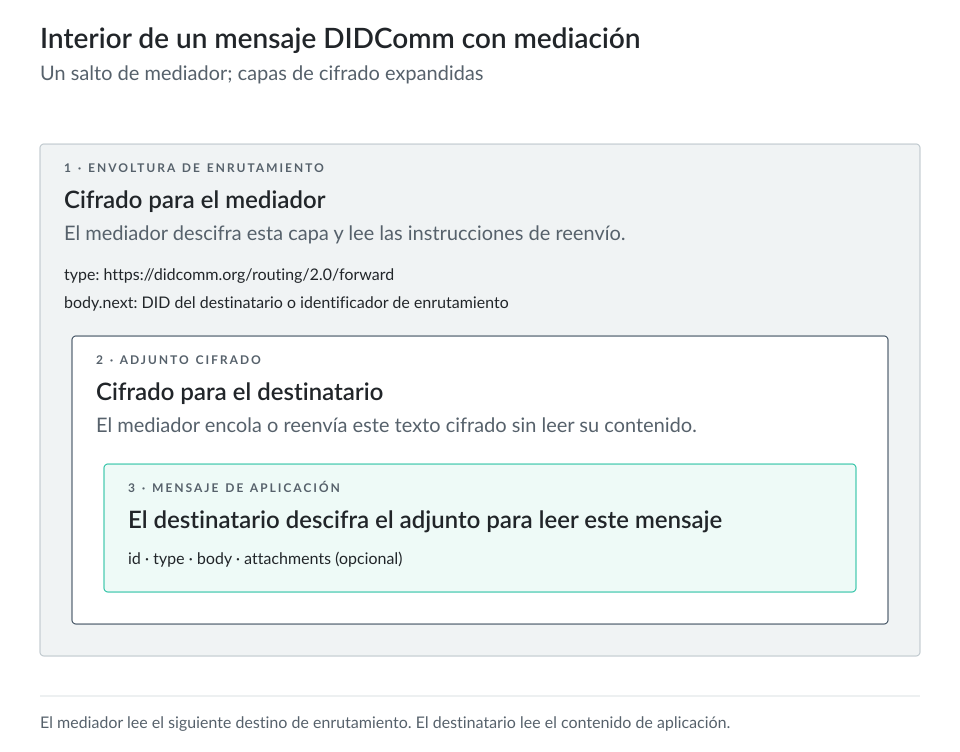

# DIDComm {#sec-didcomm}

## Descripción general

**DIDComm** (*Decentralized Identifier Communication*, comunicación mediante identificadores descentralizados) es un componente esencial del ecosistema de identidad autosoberana (SSI). Proporciona la capa de mensajería segura que permite interactuar a los identificadores descentralizados (DIDs). La especificación actual, **DIDComm v2**, evolucionó a partir de versiones anteriores para responder a las necesidades crecientes de privacidad, seguridad e interoperabilidad en las comunicaciones de identidad digital. Su propósito fundamental es permitir una comunicación segura, privada y autenticada entre entidades identificadas por DIDs, con independencia de su infraestructura o conjunto de tecnologías. Así transforma los DIDs de identificadores estáticos en puntos de comunicación dinámicos capaces de participar en interacciones complejas.

En el conjunto de tecnologías SSI, DIDComm se sitúa por encima de la capa básica de DID, que proporciona identificadores y material criptográfico, y por debajo de los protocolos específicos de aplicación que definen interacciones como el intercambio de credenciales. Esta posición convierte a DIDComm en el vínculo entre las interacciones SSI de Identus y permite todas las interacciones de identidad de nivel superior.

## Características principales

El diseño de DIDComm incorpora varias características que lo hacen adecuado para las comunicaciones de identidad descentralizada:

**La independencia del transporte** permite que los mensajes DIDComm viajen por casi cualquier canal de comunicación: HTTP(S), WebSockets, Bluetooth, NFC, redes de malla o incluso códigos QR. Esta flexibilidad evita que las interacciones de identidad dependan de infraestructuras de red específicas y permite comunicaciones entre pares incluso sin conexión o con conectividad intermitente.

**El cifrado de extremo a extremo** garantiza que el contenido de los mensajes permanezca confidencial entre el remitente y los destinatarios previstos, incluso cuando atraviesa redes o intermediarios que no son de confianza. Mediante criptografía de clave pública derivada de los DIDs, DIDComm crea canales seguros que protegen la información sensible de identidad.

**La autenticación y la confianza** forman parte de DIDComm, porque cada mensaje permite verificar criptográficamente que procede de un DID específico. Esta autenticación no necesita autoridades centrales y permite que las partes establezcan confianza directamente entre sí.

**Las funciones asíncronas** permiten comunicaciones que no requieren que ambas partes estén conectadas al mismo tiempo. Los mensajes pueden entrar en cola, almacenarse y reenviarse hasta llegar a su destino. Por ello, DIDComm sirve para numerosos casos reales donde la conectividad continua no está garantizada.

**Los mecanismos de enrutamiento y reenvío de mensajes** permiten que las comunicaciones recorran rutas complejas, incluso mediante mediadores y retransmisores, y mantengan la seguridad de extremo a extremo. Esta capacidad resulta esencial para entidades detrás de cortafuegos o NAT, o para aumentar la privacidad al ocultar metadatos de red.

## Estructura del mensaje

Los mensajes de [DIDComm Messaging](https://identity.foundation/didcomm-messaging/spec/) usan envolturas cifradas JSON Web Message ([JWM](https://datatracker.ietf.org/doc/html/draft-looker-jwm-01)). Este formato estándar garantiza la interoperabilidad y proporciona las propiedades de seguridad necesarias.

Un mensaje DIDComm típico consta de:

- **Cabeceras**: metadatos del mensaje, incluidos identificadores, tipos, información temporal y detalles de enrutamiento.
- **Cuerpo**: el contenido o la carga útil del mensaje.
- **Adjuntos**: datos adicionales opcionales, que pueden incluir datos estructurados, documentos o medios.

Estos componentes forman un JWM que normalmente se cifra o firma según los requisitos de seguridad de la interacción. La estructura resultante proporciona un formato uniforme de envoltura que puede transportar cualquier tipo de contenido y garantizar su seguridad e integridad.

Cada mensaje contiene un identificador único y puede referenciar otros mensajes mediante mecanismos de hilos de conversación. Esto permite conversaciones complejas con varios mensajes. Los mensajes también declaran su tipo, que los vincula con protocolos específicos que definen la secuencia y el significado esperados de la interacción.

::: {.content-visible when-format="html:js"}

:::

::: {.content-visible unless-format="html:js"}
{fig-alt="Interior de un mensaje DIDComm con mediación"}
:::

## Protocolos

DIDComm define formatos de mensaje y un marco para protocolos: secuencias estándar de mensajes que cumplen tareas específicas. Estos protocolos permiten la interoperabilidad al garantizar que distintas implementaciones comprendan las mismas secuencias de mensajes y sus significados.

El marco de protocolos incluye mecanismos para descubrir qué protocolos admite un agente y para gestionar sus versiones a medida que evolucionan. Esto permite actualizaciones graduales y compatibilidad con versiones anteriores en el ecosistema.

El ecosistema SSI ha desarrollado varios protocolos comunes:

- **Los protocolos de establecimiento de conexión** definen cómo dos partes pueden establecer un canal DIDComm seguro.
- **Los protocolos de emisión de credenciales** estandarizan cómo ofrecer y emitir credenciales verificables.
- **Los protocolos de presentación de credenciales** definen cómo solicitar y presentar credenciales.
- **Los protocolos de ping de confianza** ofrecen mecanismos simples para verificar que un canal de comunicación está activo.

Al estandarizar estos patrones de interacción, DIDComm permite que distintas implementaciones cooperen sin dificultades y contribuye a un ecosistema abierto en lugar de soluciones aisladas.

Puedes encontrar todos los protocolos publicados actualmente [aquí](https://didcomm.org/search/?page=1). La comunidad los mantiene. También puedes construir y definir tus propios protocolos para tu caso de uso específico, aunque decidas no publicarlos.

## Interacción de ejemplo

Para ilustrar cómo funciona DIDComm en la práctica, considera un caso típico de emisión de credenciales:

1. Un emisor y un titular establecen una conexión DIDComm e intercambian DIDs y puntos de acceso de servicios.
2. El emisor envía un mensaje de oferta que indica qué credenciales puede proporcionar.
3. El titular responde con un mensaje de solicitud de una credencial específica.
4. El emisor crea la credencial y la envía en un mensaje de emisión.
5. El titular confirma la recepción mediante un mensaje de confirmación.

Durante esta interacción, todos los mensajes usan cifrado de extremo a extremo. Aunque pasen por intermediarios, el contenido permanece privado entre el emisor y el titular. Los mensajes pueden viajar mediante distintos mecanismos de transporte: por ejemplo, comenzar con una conexión HTTPS y cambiar a Bluetooth para mensajes posteriores si las partes se acercan.

En los casos con mediación, el flujo adquiere más complejidad y capacidad. Un titular puede recibir mensajes mediante un servicio de mediador que proporciona una entrega constante incluso cuando el dispositivo del titular está desconectado. El mediador recibe mensajes cifrados, los almacena hasta que el titular se conecta y los reenvía sin poder leer nunca el contenido cifrado.

## Ventajas

DIDComm ofrece varias ventajas esenciales que apoyan los principios básicos de la identidad autosoberana:

**La protección de la privacidad** ocupa un lugar central en el diseño de DIDComm. Al cifrar el contenido de los mensajes y permitir interacciones con seudónimos mediante DIDs específicos de cada relación, DIDComm permite que las personas controlen qué información comparten y con quién. La independencia del transporte también ayuda a evitar la correlación mediante metadatos de red.

**La comunicación descentralizada** libera las interacciones de identidad de la dependencia de proveedores centrales de mensajería o centros de identidad. Las partes pueden comunicarse directamente o mediante los mediadores que elijan, y evitar la dependencia de un proveedor y los puntos únicos de fallo.

**La interoperabilidad** entre distintas implementaciones SSI mantiene el ecosistema abierto y competitivo. Un titular que usa una implementación de billetera puede interactuar sin dificultades con verificadores y emisores que usan conjuntos de software distintos, siempre que todos admitan los protocolos DIDComm.

**El control del usuario** abarca los datos de identidad y los propios canales de comunicación. Las personas pueden elegir cómo, cuándo y dónde reciben comunicaciones relacionadas con su identidad digital. Esto refuerza la naturaleza autosoberana del sistema.

## DIDComm en Identus

Identus ha adoptado DIDComm v2 como protocolo estándar de comunicación y lo implementa en todo el marco para permitir mensajería segura y privada entre DIDs. Esta implementación estandariza numerosas interacciones importantes, incluida la comunicación esencial entre mediadores y sus pares.

La integración con mediadores tiene especial importancia en la arquitectura de Identus. Los mediadores pueden recibir, almacenar y reenviar mensajes DIDComm, lo que permite la comunicación asíncrona incluso cuando los destinatarios están desconectados temporalmente. Esta capacidad resulta esencial para soluciones prácticas de identidad que deben funcionar de forma fiable con distintas condiciones de conectividad.

En el momento de escribir este capítulo, Identus admite DIDComm mediante sondeo de puntos de acceso HTTP, que es con diferencia la implementación más probada y estable. También lo admite mediante WebSockets que una opción de función habilita en Cloud Agent.

Para obtener detalles sobre el envío y la recepción de mensajes en Identus mediante mediadores, consulta el [capítulo @sec-mediator].
