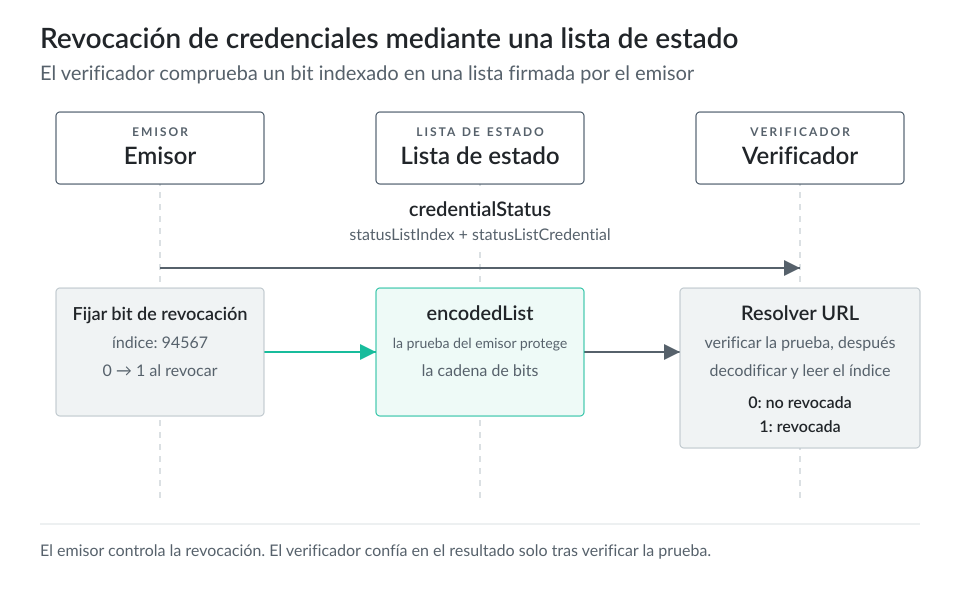

# Credenciales verificables {#sec-verifiable-credentials}

## Descripción general

Considera una credencial verificable (VC) como una declaración firmada que puede acompañar a la persona u organización que describe. Una aerolínea puede emitir una tarjeta de embarque a un viajero. Una universidad puede emitir una credencial de título a un graduado. Un organismo público puede emitir un permiso a una empresa. En cada caso, el titular conserva la credencial y después la presenta a un verificador que necesita una prueba de una afirmación.

El [modelo de datos de credenciales verificables 2.0 de W3C](https://www.w3.org/TR/vc-data-model-2.0/) define los roles principales: emisor, titular, verificador y sujeto. El emisor crea la credencial. El titular la almacena y presenta. El verificador comprueba la presentación. El sujeto es la persona, organización, cosa o cuenta que describen las afirmaciones. A veces el titular y el sujeto coinciden. En otros casos, un progenitor puede conservar una credencial de su hijo o un administrador de una empresa puede conservar credenciales sobre la empresa.

Una VC contiene cuatro tipos de información:

- Afirmaciones, como nombre, número de billete, nivel de afiliación, rango de edad o categoría de licencia.
- Información del emisor, para que el verificador determine quién hizo la declaración.
- Material de prueba, para que el verificador compruebe la integridad y la autoría.
- Metadatos, como fecha de emisión, fecha de caducidad, esquema, tipo de credencial y estado.

La prueba permite que el verificador detecte alteraciones. No decide si debe aceptar la credencial para un propósito de negocio determinado. Esa decisión depende de la política. Una puerta de embarque puede aceptar solo credenciales que la aerolínea emitió para el vuelo actual. Un verificador puede rechazar una credencial válida si no confía en el emisor, la credencial ha caducado, no acepta el esquema o la credencial está revocada.

El [README de Identus Cloud Agent](https://github.com/hyperledger-identus/cloud-agent/blob/main/README.md) describe Cloud Agent como un agente basado en W3C y Aries que puede emitir, conservar y verificar credenciales mediante DIDComm v2. Identus admite varios formatos de credenciales mediante una API REST y flujos de agente basados en webhooks.

## Formatos

Las VC comparten un propósito, pero no todas usan la misma envoltura, formato de prueba, modelo de privacidad o procedimiento de verificación. Identus Cloud Agent documenta tres formatos de emisión mediante sus API: JWT-VC, SD-JWT-VC y AnonCreds. En las cargas útiles de Cloud Agent aparecen como valores de `credentialFormat`, por ejemplo `JWT`, `SDJWT` y `AnonCreds`.

### Credenciales verificables JWT

JWT-VC empaqueta las afirmaciones de la credencial en un JSON Web Token. Los equipos suelen elegirlo cuando sus verificadores ya usan herramientas JOSE y verificación del emisor basada en DIDs. El verificador decodifica el JWT, valida la firma con la clave pública del emisor resuelta desde su DID y lee las afirmaciones.

JWT-VC tiene una limitación de privacidad. Normalmente el titular presenta la credencial completa, por lo que el verificador ve todas sus afirmaciones. Esto sirve para una puerta de embarque que necesita todos los detalles del billete. Resulta poco adecuado cuando el titular debe revelar solo uno o dos campos.

La guía de emisión DIDComm de Identus usa `jwtVcPropertiesV1` para ofertas de credenciales JWT e indica que esta estructura corresponde al perfil del modelo de datos VC 1.1 de W3C que usa el agente.

### Credenciales verificables SD-JWT

SD-JWT-VC se basa en Selective Disclosure JWT. Permite que el titular revele afirmaciones seleccionadas de una credencial en lugar del conjunto completo. Un viajero que demuestra el acceso a una sala de espera puede necesitar revelar el nivel de afiliación y la fecha de caducidad, pero no la fecha de nacimiento ni el perfil completo de cliente.

El [borrador SD-JWT VC de IETF](https://datatracker.ietf.org/doc/draft-ietf-oauth-sd-jwt-vc/) define formatos de datos y reglas de procesamiento para credenciales JSON con divulgación selectiva. En términos generales, el emisor firma una estructura que establece compromisos sobre los valores de las afirmaciones. El titular presenta después solo las divulgaciones que necesita la solicitud del verificador, y este las comprueba contra los compromisos firmados.

Identus usa `sdJwtVcPropertiesV1` para este formato y requiere claves Ed25519 del emisor y del titular para la emisión SD-JWT. La documentación Present Proof de Identus señala un detalle: si la credencial SD-JWT no tiene una clave `cnf`, el titular no puede crear y firmar una presentación vinculada al desafío y dominio del verificador. Con `cnf`, el titular puede demostrar el control de la clave vinculada durante la presentación.

### AnonCreds

AnonCreds es un formato de credencial con pruebas de conocimiento cero. Procede del ecosistema Hyperledger Indy y ahora lo mantiene [Hyperledger AnonCreds](https://anoncreds.github.io/anoncreds-spec/). Los titulares lo usan para pruebas que preservan la privacidad, como demostrar predicados sobre atributos sin divulgar sus valores originales.

AnonCreds requiere una definición de credencial. Ese artefacto referencia un esquema y contiene material criptográfico del emisor que se usa para generar pruebas. En Identus, las afirmaciones AnonCreds usan una estructura plana de cadenas a cadenas, y el emisor referencia la definición de credencial mediante `credentialDefinitionId` dentro de `anoncredsVcPropertiesV1`.

### OID4VCI

OpenID for Verifiable Credential Issuance (OpenID4VCI) es un protocolo de emisión, no un formato de credencial. Amplía los flujos de tipo OAuth 2.0 para que una billetera pueda obtener credenciales de un emisor mediante un punto de acceso de credenciales. La [OpenID Foundation aprobó OpenID4VCI 1.0 como especificación final el 16 de septiembre de 2025](https://openid.net/openid-for-verifiable-credential-issuance-1-final-specification-approved/). La [especificación](https://openid.net/specs/openid-4-verifiable-credential-issuance-1_0.html) define los metadatos del emisor, las configuraciones de credenciales, el flujo de autorización y el flujo de solicitud de credenciales.

La [guía OID4VCI de Identus](https://github.com/hyperledger-identus/cloud-agent/blob/main/docs/docusaurus/credentials/oid4vci/issue.md) describe Cloud Agent como servidor emisor de credenciales, integrado con un servidor de autorización que sigue el contrato esperado. Identus proporciona un flujo de ejemplo con Keycloak y emisión mediante código de autorización.

### Contexto de W3C VC 2.0

Los primeros despliegues VC 1.1 ya no describen todo el panorama de estándares. [W3C anunció la familia de credenciales verificables 2.0 como recomendaciones el 15 de mayo de 2025](https://www.w3.org/news/2025/the-verifiable-credentials-2-0-family-of-specifications-is-now-a-w3c-recommendation/). La [recomendación VC JOSE y COSE](https://www.w3.org/TR/vc-jose-cose/) define formas de proteger las credenciales y presentaciones del modelo de datos VC 2.0 mediante JOSE, SD-JWT y COSE.

La documentación de Identus sigue indicando los formatos y cargas útiles concretos que admite Cloud Agent. Por ello, el trabajo de implementación debe seguir primero la documentación de Cloud Agent y considerar los documentos W3C VC 2.0 como la dirección de la familia más amplia de estándares.

## Esquemas

Un esquema de credencial describe la estructura de las afirmaciones. Responde a preguntas como: ¿qué campos se esperan?, ¿cuáles son obligatorios?, ¿qué tipo de datos debe usar cada campo? Un esquema no decide si una afirmación es verdadera. Proporciona una estructura compartida para que emisores, titulares y verificadores lean la credencial.

### Especificaciones de esquemas

Identus usa dos familias de esquemas entre sus formatos de credenciales.

Las credenciales JWT y SD-JWT usan JSON Schema. La guía oficial de esquemas de Identus requiere que el cuerpo del esquema establezca `$schema` como `https://json-schema.org/draft/2020-12/schema`, que corresponde al borrador actual descrito por el [proyecto JSON Schema](https://json-schema.org/learn/getting-started-step-by-step).

Las credenciales AnonCreds usan esquemas AnonCreds junto con definiciones de credenciales. La definición de credencial referencia un esquema mediante su ID y debe existir antes de que el emisor cree una oferta de credencial AnonCreds.

### Esquema de ejemplo

Una credencial de billete de avión puede usar un JSON Schema como este:

```json
{
  "$id": "https://example.com/schemas/boarding-pass-1.0",
  "$schema": "https://json-schema.org/draft/2020-12/schema",
  "title": "Boarding pass",
  "type": "object",
  "properties": {
    "passengerName": { "type": "string" },
    "flightNumber": { "type": "string" },
    "departureAirport": { "type": "string" },
    "arrivalAirport": { "type": "string" },
    "departureDateTime": { "type": "string", "format": "date-time" },
    "seatNumber": { "type": "string" },
    "boardingGroup": { "type": "string" },
    "ticketClass": { "type": "string" }
  },
  "required": [
    "passengerName",
    "flightNumber",
    "departureAirport",
    "arrivalAirport",
    "departureDateTime",
    "seatNumber"
  ],
  "additionalProperties": false
}
```

### Crear esquemas en Identus

Identus Cloud Agent tiene un registro de esquemas para crear y resolver esquemas de credenciales. La guía oficial documenta dos puntos de acceso de creación:

```http
POST /cloud-agent/schema-registry/schemas
POST /cloud-agent/schema-registry/schemas/did-url
```

Usa el punto de acceso HTTP cuando los verificadores deban resolver el esquema mediante una URL HTTP. Usa el punto de acceso de URL DID cuando deban resolverlo mediante una URL DID. Son modos de resolución separados; considera la vía que usará el verificador antes de emitir credenciales basadas en el esquema.

Cada registro de esquema incluye metadatos sobre su definición. `name` proporciona una etiqueta legible, `version` identifica la versión, `author` indica el DID que lo creó y `tags` ayuda a filtrar los registros de esquemas. El campo `schema` contiene la definición JSON Schema. Cloud Agent trata como única la combinación de `author`, `id` del esquema y `version`.

El campo `author` debe contener el DID PRISM de forma corta que creó el mismo Cloud Agent. No necesita publicarse antes de crear el esquema. Durante la configuración, un emisor puede crear un DID, crear un esquema y publicar el DID después, cuando el flujo de credenciales necesite resolución pública.

### Versiones

Actualizar un esquema significa crear un nuevo registro con el JSON Schema modificado y una versión superior. No cambies el significado de una versión de esquema después de emitir credenciales basadas en ella. Las credenciales antiguas siguen siendo más fáciles de verificar cuando su esquema original aún se resuelve en la misma estructura.

Para cambios incompatibles, como eliminar campos obligatorios o cambiar tipos de campos, usa una nueva versión principal. Para cambios aditivos, como añadir un campo opcional, usa una versión secundaria. Así las políticas del emisor y verificador siguen siendo comprensibles cuando coexisten varias versiones de credenciales.

## Emisión

La emisión transforma los datos de afirmaciones del emisor en una credencial que conserva una billetera o agente. En Identus, puede realizarse mediante una conexión DIDComm, una invitación sin conexión previa u OpenID4VCI.

Las guías de DIDs de Identus son importantes antes de iniciar la emisión. El registrador de Cloud Agent puede crear un DID PRISM sin conexión. La plantilla de documento DID admite métodos de verificación para fines como `authentication` y `assertionMethod`. Un DID PRISM de forma larga incorpora la operación de creación en el propio DID. Un DID PRISM de forma corta necesita publicarse antes de que otras partes lo resuelvan desde el registro distribuido. La guía de publicación de DIDs de Cloud Agent documenta el flujo de publicación y los cambios de estado de `CREATED` a `PUBLICATION_PENDING` y después a `PUBLISHED`.

### Requisitos previos

Para la emisión DIDComm, la [guía Issue Credential Protocol 3.0 de Identus](https://github.com/hyperledger-identus/cloud-agent/blob/main/docs/docusaurus/credentials/didcomm/issue.md) describe los requisitos específicos de cada formato.

La emisión JWT requiere una conexión entre los agentes del emisor y del titular, un DID PRISM publicado del emisor con `assertionMethod`, un esquema de credencial y un DID PRISM del titular con `authentication`.

La emisión SD-JWT tiene la misma estructura, pero los DIDs PRISM del emisor y titular deben usar claves Ed25519 para los métodos de verificación correspondientes.

La emisión AnonCreds requiere una conexión y una definición de credencial AnonCreds.

### Estados de la credencial

Los estados del emisor son:

```text
OfferPending -> OfferSent -> RequestReceived -> CredentialPending -> CredentialGenerated -> CredentialSent
```

Los estados del titular son:

```text
OfferReceived -> RequestPending -> RequestSent -> CredentialReceived
```

Estos estados sirven cuando una billetera o controlador necesita reanudar un flujo, mostrar el progreso al usuario o decidir si aún requiere una acción manual del emisor.

::: {.content-visible when-format="html:js"}

:::

::: {.content-visible unless-format="html:js"}
{fig-alt="Emitir una credencial mediante DIDComm"}
:::

### Flujo del emisor

El emisor empieza por preparar cuatro datos: el DID del emisor, el esquema o la definición de credencial, las afirmaciones y el formato de credencial.

Para una tarjeta de embarque, la aerolínea selecciona su DID de emisor, elige el esquema de tarjeta de embarque y prepara afirmaciones como el nombre del pasajero, el número de vuelo, la fecha de salida, el asiento y el grupo de embarque. La elección de formato depende de las necesidades del verificador. Un lector de puerta puede necesitar solo una JWT-VC. Usa SD-JWT-VC cuando el viajero deba revelar solo parte de la credencial. Usa AnonCreds cuando el verificador necesite pruebas de conocimiento cero o pruebas de predicados.

El emisor crea una oferta de credencial mediante Cloud Agent:

```http
POST /cloud-agent/issue-credentials/credential-offers
```

Las ofertas JWT usan `jwtVcPropertiesV1`:

```json
{
  "connectionId": "holder-connection-id",
  "credentialFormat": "JWT",
  "jwtVcPropertiesV1": {
    "claims": {
      "passengerName": "Alice Wonderland",
      "flightNumber": "ID123",
      "departureAirport": "SCL",
      "arrivalAirport": "EZE",
      "seatNumber": "12A"
    },
    "issuingDID": "did:prism:issuer",
    "credentialSchema": {
      "id": "http://localhost:8080/cloud-agent/schema-registry/schemas/...",
      "type": "JsonSchemaValidator2018"
    }
  }
}
```

Las ofertas SD-JWT usan `sdJwtVcPropertiesV1`:

```json
{
  "connectionId": "holder-connection-id",
  "credentialFormat": "SDJWT",
  "sdJwtVcPropertiesV1": {
    "claims": {
      "passengerName": "Alice Wonderland",
      "flightNumber": "ID123",
      "boardingGroup": "A",
      "exp": 1883000000
    },
    "issuingDID": "did:prism:issuer",
    "credentialSchema": {
      "id": "http://localhost:8080/cloud-agent/schema-registry/schemas/...",
      "type": "JsonSchemaValidator2018"
    }
  }
}
```

Las ofertas AnonCreds usan `anoncredsVcPropertiesV1` y un `credentialDefinitionId`:

```json
{
  "connectionId": "holder-connection-id",
  "credentialFormat": "AnonCreds",
  "anoncredsVcPropertiesV1": {
    "claims": {
      "passengerName": "Alice Wonderland",
      "flightNumber": "ID123",
      "seatNumber": "12A"
    },
    "issuingDID": "did:prism:issuer",
    "credentialDefinitionId": "credential-definition-id"
  }
}
```

Después de crear la oferta, el emisor observa el estado del registro de emisión. Si el titular acepta la oferta y el emisor usa emisión automática, Cloud Agent emite la credencial cuando llega la solicitud del titular. Si la emisión automática está deshabilitada, el emisor envía la credencial desde el registro correspondiente:

```http
POST /cloud-agent/issue-credentials/records/{recordId}/issue-credential
```

### Flujo del titular

El titular recibe una oferta de credencial, la revisa y la acepta. En una billetera para usuarios, esa revisión debe mostrar el emisor, el tipo de credencial, el formato solicitado, una vista previa de las afirmaciones y los detalles relevantes para la privacidad. El titular debe saber qué acepta antes de que la billetera lo almacene.

El titular puede recuperar los registros de emisión de credenciales:

```http
GET /cloud-agent/issue-credentials/records
```

Para aceptar una oferta JWT o SD-JWT, el titular proporciona un DID PRISM como `subjectId`:

```json
{
  "subjectId": "did:prism:holder"
}
```

Para credenciales SD-JWT con vinculación de clave, el titular puede incluir `keyId`:

```json
{
  "subjectId": "did:prism:holder",
  "keyId": "key-1"
}
```

Las ofertas AnonCreds no usan `subjectId` de la misma forma. El titular acepta la oferta con un cuerpo vacío:

```json
{}
```

Después de aceptar, el titular recibe la credencial emitida mediante DIDComm. Identus documenta estados del titular como `OfferReceived`, `RequestPending`, `RequestSent` y `CredentialReceived`. La billetera almacena la credencial y después la usa en un flujo de presentación.

### Emisión sin conexión previa

La emisión sin conexión previa sirve cuando el emisor y el titular aún no tienen una conexión DIDComm. La [guía de emisión sin conexión previa de Identus](https://github.com/hyperledger-identus/cloud-agent/blob/main/docs/docusaurus/credentials/connectionless/issue.md) documenta un punto de acceso de invitación fuera de banda:

```http
POST /cloud-agent/issue-credentials/credential-offers/invitation
```

El emisor crea una invitación y comparte el código devuelto, por ejemplo mediante un código QR o enlace. El titular acepta la invitación mediante una billetera o SDK. El emisor responde con una oferta de credencial y continúan los pasos normales de aceptación del titular y emisión del emisor.

Un puesto de registro de una conferencia podría mostrar un código QR que inicia la emisión de una credencial de asistente. El asistente lo escanea con una billetera, acepta la oferta y recibe la credencial sin crear primero una relación permanente con el emisor.

### Emisión OpenID4VCI

OID4VCI sirve para emisores que ya usan recorridos de usuario basados en OAuth. La emisión DIDComm sirve para billeteras y emisores que ya participan en protocolos entre agentes. Un despliegue de producción puede admitir ambas vías, y la política decide cuál corresponde a cada tipo de credencial.

En el modelo OID4VCI de Identus, Cloud Agent actúa como servidor emisor de credenciales. La billetera sigue el flujo de autorización, obtiene un token de acceso del servidor de autorización y usa ese token en el punto de acceso de credenciales. La política concreta reside en la configuración del emisor y del servidor de autorización, no en la billetera.

## Presentación y verificación

La emisión proporciona una credencial al titular. La presentación permite que el titular demuestre algo con ella.

En Identus, la [guía Present Proof Protocol 3.0](https://github.com/hyperledger-identus/cloud-agent/blob/main/docs/docusaurus/credentials/didcomm/present-proof.md) describe los flujos del verificador, titular y demostrador mediante DIDComm. Un verificador crea una solicitud de prueba:

```http
POST /cloud-agent/present-proof/presentations
```

La solicitud puede incluir `domain` y `challenge`. Estos valores vinculan la presentación al verificador y a la sesión, lo que reduce el riesgo de repetición. El titular revisa la solicitud, selecciona credenciales y la acepta:

```http
PATCH /cloud-agent/present-proof/presentations/{id}
```

La carga útil concreta depende del formato de credencial. Las presentaciones JWT usan `proofId`. Las presentaciones SD-JWT divulgan afirmaciones seleccionadas y usan `credentialFormat: SDJWT`. Las presentaciones AnonCreds usan una solicitud de presentación AnonCreds.

Después de verificar, Identus puede llegar a `PresentationVerified`. El verificador puede aceptar después la presentación, lo que cambia el registro a `PresentationAccepted`. Esta separación importa. La verificación comprueba la validez criptográfica y las reglas del protocolo. La aceptación registra una decisión de negocio del verificador.

En el ejemplo de la aerolínea, una credencial de billete válida aún puede incumplir la política de negocio. Un viajero puede tener un billete legítimo y aun así carecer del visado obligatorio, llegar después del cierre de la puerta o no superar una comprobación de seguridad. La verificación VC informa de si la credencial es auténtica, íntegra y aceptable según las reglas del protocolo. El verificador aún decide si la acepta para el viaje.

## Revocación

La revocación permite que el emisor marque una credencial como no válida antes de su caducidad natural. Una aerolínea puede revocar una tarjeta de embarque después de cancelar una reserva. Una universidad puede revocar una credencial emitida por error. Una empresa puede revocar una credencial de empleado cuando termina su relación laboral.

La [guía de revocación de Identus](https://github.com/hyperledger-identus/cloud-agent/blob/main/docs/docusaurus/credentials/revocation.md) documenta la revocación de credenciales JWT mediante Verifiable Credentials Status List v2021. Una credencial revocable contiene un objeto `credentialStatus` con campos como `type`, `statusPurpose`, `statusListIndex` y `statusListCredential`.

### Mecanismo de revocación

Una credencial revocable contiene datos de estado como estos:

```json
{
  "credentialStatus": {
    "id": "http://localhost:8080/cloud-agent/credential-status/[UUID]#[INDEX]",
    "type": "StatusList2021Entry",
    "statusPurpose": "revocation",
    "statusListIndex": "94567",
    "statusListCredential": "http://localhost:8080/cloud-agent/credential-status/[UUID]"
  }
}
```

La URL `statusListCredential` apunta a una credencial de lista de estado. Esa credencial contiene una cadena de bits codificada donde cada posición corresponde a una credencial. `statusListIndex` identifica la posición de la credencial en esa cadena. Cuando el emisor revoca una credencial, cambia el bit correspondiente de 0 a 1.

::: {.content-visible when-format="html:js"}

:::

::: {.content-visible unless-format="html:js"}
{fig-alt="Comprobar una credencial contra una lista de estado"}
:::

### Revocar una credencial

Solo el emisor de una credencial puede revocarla. Identus expone la operación de revocación como:

```http
PATCH /cloud-agent/revoke-credential/{credential_id}
```

El emisor puede encontrar el ID de la credencial al listar los registros de credenciales emitidas y llamar después al punto de acceso de revocación para la credencial de destino. Tras la revocación, una verificación Present Proof posterior falla si el titular presenta esa credencial. Así la revocación permanece en la vía de verificación y no depende de que el titular elimine credenciales antiguas de su almacenamiento.

### Comprobar el estado de revocación

Cuando un verificador recibe una presentación con una credencial que contiene `credentialStatus`, comprueba la lista de estado antes de aceptar la credencial.

Primero recupera la credencial de lista de estado desde `credentialStatus.statusListCredential`. Después verifica la prueba incorporada en esa credencial de estado. Identus documenta dos tipos de prueba compatibles para credenciales de lista de estado: `DataIntegrityProof` con `eddsa-jcs-2022` para claves Ed25519 y `EcdsaSecp256k1Signature2019` para claves secp256k1.

Después de verificar la prueba, el verificador decodifica `credentialSubject.encodedList` y comprueba el bit en `statusListIndex`. Si el bit vale 1, la credencial está revocada. Si vale 0, la lista de estado no ha revocado esa credencial.

Este modelo de lista de estado tiene una ventaja de privacidad: el verificador recupera toda la lista en lugar de preguntar al emisor por una credencial concreta. El emisor no sabe qué credencial comprobó el verificador.

W3C publicó [Bitstring Status List v1.0](https://www.w3.org/TR/vc-bitstring-status-list/) como parte de la familia de recomendaciones VC 2.0 el 15 de mayo de 2025. La documentación de Identus citada arriba aún indica Status List v2021 para la revocación de credenciales JWT. Por ello, los implementadores deben seguir la guía actual de Identus para el comportamiento de Cloud Agent y consultar versiones futuras de Identus por posibles migraciones de listas de estado.
