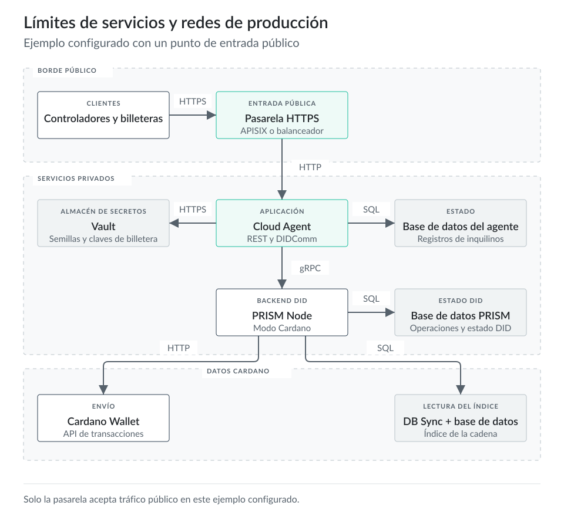
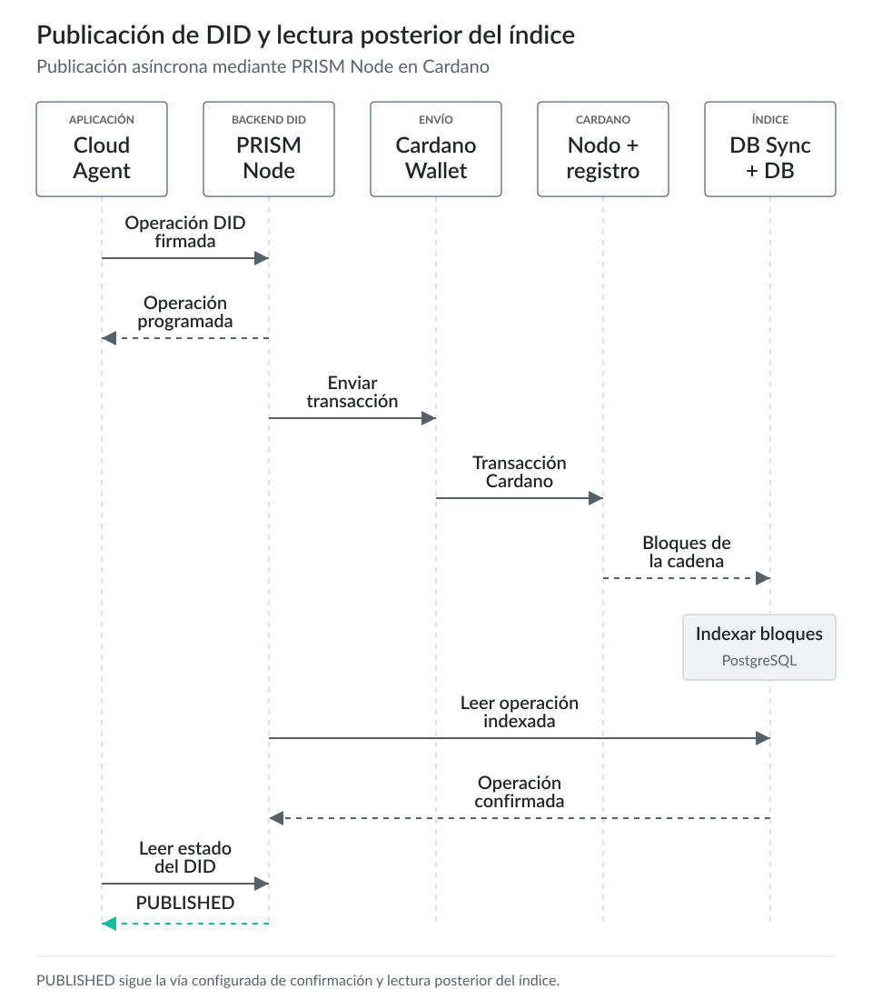
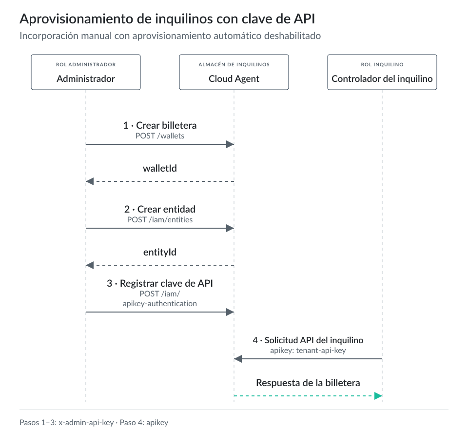
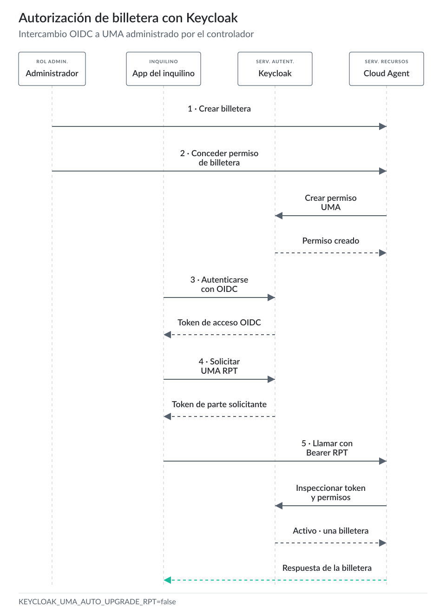

# Instalación: entorno de producción {#sec-installation-production}

## Alcance

La sección 2 inicia dos instancias locales de Cloud Agent con un PRISM Node de desarrollo. Este capítulo mantiene el mismo recorrido de aprendizaje y lo lleva hacia un despliegue `preprod` con características de producción. El objetivo es mostrar los límites entre servicios que un desarrollador debe comprender antes de que un servicio real de emisor o verificador dependa de Identus.

Los ejemplos de este capítulo son una base de preproducción para el aprendizaje de operadores. Muestran cómo copiar la configuración Docker local, fijar versiones actuales de componentes, exponer URLs públicas de Cloud Agent, proteger puertos de servicios, conectar PRISM Node con servicios Cardano y separar las simplificaciones del tutorial de los requisitos de producción.

Ejecuta primero este capítulo en Cardano `preprod`. Pasa a `mainnet` después de que el despliegue supere las comprobaciones de estado, billetera, DB Sync, publicación de DIDs y copias de seguridad al final del capítulo.

## Selección de versiones

Usa las notas de versiones de Identus Platform como primera fuente de compatibilidad. Cuando se comprobó este capítulo el 14 de junio de 2026, la versión más reciente de Identus Platform era `v2.16`. Esa versión incluye Cloud Agent `2.1.0`, Mediator `1.2.0`, NeoPRISM `0.6.2` y SDK-TS `7.0.0`.

El repositorio del componente Cloud Agent tiene una versión más reciente, `v2.2.0`. Añade trabajo en los drivers VDR y el backend NeoPRISM. Trátala como una versión de componente que requiere comprobar la compatibilidad con la versión fijada de la plataforma. El README de Cloud Agent advierte que los pares de imágenes de Cloud Agent y PRISM Node sin comprobar pueden fallar en las comprobaciones de compatibilidad.

Este capítulo fija estas versiones:

```bash
AGENT_VERSION=2.1.0
PRISM_NODE_VERSION=2.6.1
CARDANO_WALLET_TAG=v2026-05-11
CARDANO_DB_SYNC_VERSION=13.7.1.0
```

`AGENT_VERSION` sigue la última versión de la plataforma. `PRISM_NODE_VERSION` sigue la última versión de PRISM Node comprobada para este capítulo, `v2.6.1`. Si cambias cualquiera de las imágenes Identus, vuelve a ejecutar la lista completa de comprobaciones al final del capítulo.

Las notas de la versión `v2026-05-11` de Cardano Wallet la emparejan con `cardano-node` `11.0.1`. La última versión de Cardano DB Sync comprobada para este capítulo era `13.7.1.0`.

## Modelo de despliegue

Un despliegue Identus de producción tiene varios actores y servicios:

- La aplicación controladora llama a la API REST de Cloud Agent y recibe webhooks.
- Cloud Agent administra el estado de los inquilinos, billeteras, DIDs, mensajes DIDComm V2, emisión, verificación y almacenamiento de credenciales, y publicación de listas de estado.
- PostgreSQL almacena el estado de Cloud Agent. PRISM Node y Cardano DB Sync necesitan sus propias bases de datos PostgreSQL.
- Vault almacena semillas de billetera y material secreto cuando `SECRET_STORAGE_BACKEND=vault`.
- El backend del nodo DID publica y resuelve operaciones `did:prism`. La configuración actual de Cloud Agent puede usar PRISM Node, NeoPRISM u otros drivers VDR según las opciones de driver seleccionadas.
- PRISM Node actúa como nodo de nivel 2 sobre Cardano. Con `NODE_LEDGER=cardano`, usa Cardano Wallet para enviar transacciones y Cardano DB Sync para leer bloques.
- Cardano Wallet se conecta a un nodo Cardano mediante su socket y expone una API HTTP a PRISM Node.
- Cardano DB Sync sigue el mismo nodo Cardano e indexa bloques en PostgreSQL para PRISM Node.

::: {.content-visible when-format="html:js"}

:::

::: {.content-visible unless-format="html:js"}
{fig-alt="Límites de servicios y redes de producción"}
:::

Para una vía de publicación `did:prism`:

1. El controlador del emisor solicita a Cloud Agent crear, actualizar o desactivar un DID `did:prism`.
2. Cloud Agent usa la semilla de billetera y la ruta de derivación almacenada para reconstruir el material de claves de la operación DID.
3. Cloud Agent firma la operación y la envía al backend de nodo DID configurado.
4. PRISM Node recibe la operación firmada, la programa, usa Cardano Wallet para enviar una transacción Cardano y lee bloques indexados mediante Cardano DB Sync.
5. Cloud Agent o el resolvedor lee el estado del DID cuando la operación alcanza la profundidad de confirmación configurada.

::: {.content-visible when-format="html:js"}

:::

::: {.content-visible unless-format="html:js"}
{fig-alt="Publicación de DID y lectura posterior del índice"}
:::

La verificación de credenciales sigue una vía de decisión distinta. El software del verificador realiza comprobaciones técnicas como la verificación de pruebas, resolución de DIDs, uso de claves, estado de credenciales y vinculación de presentaciones. La parte que confía en el resultado aplica después comprobaciones de política, como DIDs de emisores aceptados, esquemas, tipos de credenciales, entradas de registros de confianza o reglas de negocio.

## Requisitos de hardware y datos

Usa la carga real y los requisitos de servicios Cardano para dimensionar la producción. Cloud Agent consume pocos recursos en comparación con los servicios Cardano. El dimensionamiento depende de la tasa de solicitudes, número de inquilinos, volumen de webhooks, emisión y verificación de credenciales, latencia de base de datos y latencia del almacenamiento de secretos.

Cardano DB Sync consume más recursos que el resto de este entorno. La página oficial de requisitos del sistema DB Sync indicaba estos requisitos de mainnet cuando se comprobó para este capítulo:

- Host Linux.
- Al menos 64 GB de RAM.
- Al menos 4 núcleos de CPU.
- Almacenamiento SSD con 60 000 IOPS o más.
- Al menos 700 GB de disco.

La misma página indicaba ejemplos actuales de almacenamiento mainnet de unos 203 GB para la base de datos del nodo Cardano, unos 10 GB para el estado del registro distribuido de DB Sync y unos 438 GB para la base de datos PostgreSQL de DB Sync. Indicaba ejemplos de memoria mainnet de unos 24 GB para `cardano-node` y unos 21 GB de RSS para `cardano-db-sync`.

`preprod` es mucho menor. La página DB Sync indicaba unos 12 GB para la base de datos del nodo Cardano, unos 2 GB para el estado del registro distribuido de DB Sync, unos 16 GB para su base de datos PostgreSQL, unos 5,5 GB de RAM para `cardano-node` y unos 3,5 GB de RSS para `cardano-db-sync`.

Ejecuta DB Sync y su base de datos PostgreSQL cerca uno del otro. La documentación recomienda ubicarlos juntos para reducir la latencia del tráfico de base de datos durante la sincronización. Si separas servicios entre máquinas, usa una red privada de baja latencia y supervisa las IOPS de la base de datos.

## Preparar la configuración básica de Identus

Clona el repositorio actual de Cloud Agent y copia el directorio de infraestructura local en un directorio `preprod`:

```bash
git clone https://github.com/hyperledger-identus/cloud-agent identus-cloud-agent
cd identus-cloud-agent

cp -R infrastructure/local infrastructure/preprod
cp infrastructure/shared/docker-compose.yml infrastructure/shared/docker-compose-preprod.yml
```

Edita `infrastructure/preprod/run.sh` para que el script de preproducción use el archivo Compose copiado:

```diff
 PORT=${PORT} NETWORK=${NETWORK} DOCKERHOST=${DOCKERHOST} docker compose \
   -p ${NAME} \
-  -f ${SCRIPT_DIR}/../shared/docker-compose.yml \
+  -f ${SCRIPT_DIR}/../shared/docker-compose-preprod.yml \
   --env-file ${ENV_FILE} ${DEBUG} up ${BACKGROUND} ${WAIT}
```

Si tu copia aún referencia el registro antiguo de Cloud Agent, actualiza el nombre de imagen en `infrastructure/shared/docker-compose-preprod.yml`:

```diff
 cloud-agent:
-  image: ghcr.io/hyperledger/identus-cloud-agent:${AGENT_VERSION}
+  image: docker.io/hyperledgeridentus/identus-cloud-agent:${AGENT_VERSION:-latest}
```

Mantén PostgreSQL fuera de la red del host. Añade una vía privada de administración cuando los operadores necesiten acceso directo a la base de datos:

```diff
 db:
-  ports:
-    - "127.0.0.1:${PG_PORT:-5432}:5432"
+  # Keep PostgreSQL inside the Docker network for this tutorial.
+  # Add a host binding for a private administration path.
+  # ports:
+  #   - "127.0.0.1:${PG_PORT:-5432}:5432"
```

Define explícitamente el entorno de Cloud Agent. Su configuración actual admite `NODE_BACKEND`, ajustes de conexión de PRISM Node y NeoPRISM, y opciones de drivers VDR:

```diff
 cloud-agent:
   environment:
     POLLUX_STATUS_LIST_REGISTRY_PUBLIC_URL: ${POLLUX_STATUS_LIST_REGISTRY_PUBLIC_URL}
     DIDCOMM_SERVICE_URL: ${DIDCOMM_SERVICE_URL}
     REST_SERVICE_URL: ${REST_SERVICE_URL}
     PRISM_NODE_HOST: ${PRISM_NODE_HOST:-prism-node}
     PRISM_NODE_PORT: ${PRISM_NODE_PORT:-50053}
+    PRISM_NODE_USE_PLAIN_TEXT: ${PRISM_NODE_USE_PLAIN_TEXT:-true}
+    NODE_BACKEND: ${NODE_BACKEND:-prism-node}
+    NEOPRISM_BASE_URL: ${NEOPRISM_BASE_URL}
     VAULT_ADDR: ${VAULT_ADDR:-http://vault-server:8200}
     VAULT_TOKEN: ${VAULT_TOKEN:-root}
-    SECRET_STORAGE_BACKEND: postgres
-    DEV_MODE: true
+    SECRET_STORAGE_BACKEND: ${SECRET_STORAGE_BACKEND:-postgres}
+    DEV_MODE: ${DEV_MODE:-true}
+    VDR_PRISM_NODE_DRIVER_ENABLED: ${VDR_PRISM_NODE_DRIVER_ENABLED:-false}
+    VDR_NEOPRISM_DRIVER_ENABLED: ${VDR_NEOPRISM_DRIVER_ENABLED:-false}
     ADMIN_TOKEN:
     API_KEY_SALT:
     API_KEY_ENABLED:
     API_KEY_AUTHENTICATE_AS_DEFAULT_USER:
     API_KEY_AUTO_PROVISIONING:
```

Usa PRISM Node para este capítulo:

```bash
NODE_BACKEND=prism-node
PRISM_NODE_HOST=prism-node
PRISM_NODE_PORT=50053
PRISM_NODE_USE_PLAIN_TEXT=true
```

Los nuevos despliegues deben evaluar NeoPRISM antes de mainnet. La documentación VDR actual de Cloud Agent recomienda el driver NeoPRISM para producción e indica el de PRISM Node como una opción de producción heredada. Este capítulo conserva PRISM Node para mostrar en detalle los límites de Cardano Wallet y DB Sync.

## Crear el archivo de entorno de preproducción

Crea `infrastructure/preprod/.env-preprod`:

```bash
cat > ./infrastructure/preprod/.env-preprod <<EOF
### Identus image pins
AGENT_VERSION=2.1.0
PRISM_NODE_VERSION=2.6.1

### Docker project and public URLs
PORT=8000
NETWORK=identus-preprod
DOCKERHOST=agent.example.test
REST_SERVICE_URL=https://agent.example.test/cloud-agent
DIDCOMM_SERVICE_URL=https://agent.example.test/didcomm
POLLUX_STATUS_LIST_REGISTRY_PUBLIC_URL=https://agent.example.test/cloud-agent

### Cloud Agent access control
API_KEY_ENABLED=true
API_KEY_AUTO_PROVISIONING=false
API_KEY_AUTHENTICATE_AS_DEFAULT_USER=false
ADMIN_TOKEN=replace-with-admin-token
API_KEY_SALT=replace-with-long-random-salt
DEFAULT_WALLET_ENABLED=false

### Secret storage
SECRET_STORAGE_BACKEND=postgres
VAULT_ADDR=http://vault-server:8200
VAULT_USE_SEMANTIC_PATH=true
VAULT_DEV_ROOT_TOKEN_ID=replace-for-lab
VAULT_TOKEN=replace-for-lab

### Databases
AGENT_DB_USER=postgres
AGENT_DB_PASSWORD=replace-with-agent-db-password
PGADMIN_DEFAULT_PASSWORD=replace-with-pgadmin-password

### DID node backend
NODE_BACKEND=prism-node
PRISM_NODE_HOST=prism-node
PRISM_NODE_PORT=50053
PRISM_NODE_USE_PLAIN_TEXT=true
VDR_PRISM_NODE_DRIVER_ENABLED=false
VDR_NEOPRISM_DRIVER_ENABLED=false

### PRISM Node Cardano mode
NODE_LEDGER=cardano
NODE_CARDANO_NETWORK=testnet
NODE_CARDANO_WALLET_ID=replace-after-wallet-create
NODE_CARDANO_WALLET_PASSPHRASE=replace-after-wallet-create
NODE_CARDANO_PAYMENT_ADDRESS=replace-after-wallet-create
NODE_CARDANO_WALLET_API_HOST=cardano-wallet
NODE_CARDANO_WALLET_API_PORT=8090
NODE_CARDANO_DB_SYNC_HOST=cardano-db-sync-postgres:5432
NODE_CARDANO_DB_SYNC_DATABASE=cexplorer
NODE_CARDANO_DB_SYNC_USERNAME=postgres
NODE_CARDANO_DB_SYNC_PASSWORD=replace-with-db-sync-password

### Cardano services
CARDANO_NETWORK=preprod
CARDANO_WALLET_TAG=v2026-05-11
CARDANO_DB_SYNC_VERSION=13.7.1.0
NODE_DB=$PWD/cardano/node-db
WALLET_DB=$PWD/cardano/wallet-db
NODE_CONFIGS=$PWD/cardano/configs
NODE_SOCKET_DIR=$PWD/cardano/ipc
NODE_SOCKET_NAME=node.socket
WALLET_PORT=127.0.0.1:8090

### Keycloak, disabled until the Keycloak section is completed
KEYCLOAK_ENABLED=false
KEYCLOAK_URL=https://iam.example.test
KEYCLOAK_REALM=identus
KEYCLOAK_CLIENT_ID=cloud-agent
KEYCLOAK_CLIENT_SECRET=replace-when-keycloak-enabled
KEYCLOAK_UMA_AUTO_UPGRADE_RPT=false
EOF
```

`SECRET_STORAGE_BACKEND=postgres` mantiene pequeño el laboratorio. La documentación de almacenamiento de secretos de Cloud Agent indica que PostgreSQL almacena los secretos en texto sin cifrar y no sirve para producción. Antes de que llegue tráfico del emisor a este entorno, establece `SECRET_STORAGE_BACKEND=vault` y configura Vault con un servidor de producción, una política de tokens o AppRole.

## Ejemplo Compose con características de producción

El ejemplo `infrastructure/shared/docker-compose-preprod.yml` reúne los cambios anteriores en un archivo. Conserva la vista completa de configuración del tutorial original y mantiene visibles los límites de producción.

Este archivo aún es una base de laboratorio de preproducción. Sustituye el servidor Vault de desarrollo, las credenciales predeterminadas de base de datos, el listener HTTP de APISIX y la definición del servicio DB Sync antes de mainnet. Mantén el archivo bajo control de versiones para que los desarrolladores comparen el entorno local con el entorno de características de producción.

```yaml
---
version: "3.8"

services:
  db:
    image: postgres:13
    environment:
      POSTGRES_MULTIPLE_DATABASES: "pollux,connect,agent,node_db"
      POSTGRES_USER: ${AGENT_DB_USER:-postgres}
      POSTGRES_PASSWORD: ${AGENT_DB_PASSWORD}
    volumes:
      - pg_data_db:/var/lib/postgresql/data
      - ./postgres/init-script.sh:/docker-entrypoint-initdb.d/init-script.sh
      - ./postgres/max_conns.sql:/docker-entrypoint-initdb.d/max_conns.sql
    # Keep the database inside the Docker network.
    # ports:
    #   - "127.0.0.1:${PG_PORT:-5432}:5432"
    healthcheck:
      test: ["CMD", "pg_isready", "-U", "${AGENT_DB_USER:-postgres}", "-d", "agent"]
      interval: 10s
      timeout: 5s
      retries: 5

  pgadmin:
    image: dpage/pgadmin4
    environment:
      PGADMIN_DEFAULT_EMAIL: ${PGADMIN_DEFAULT_EMAIL:-pgadmin4@pgadmin.org}
      PGADMIN_DEFAULT_PASSWORD: ${PGADMIN_DEFAULT_PASSWORD}
      PGADMIN_CONFIG_SERVER_MODE: "False"
    volumes:
      - pgadmin:/var/lib/pgadmin
    ports:
      - "127.0.0.1:${PGADMIN_PORT:-5050}:80"
    depends_on:
      db:
        condition: service_healthy
    profiles:
      - debug

  vault-server:
    image: hashicorp/vault:1.15.6
    environment:
      VAULT_ADDR: "http://0.0.0.0:8200"
      VAULT_DEV_ROOT_TOKEN_ID: ${VAULT_DEV_ROOT_TOKEN_ID}
    command: server -dev -dev-root-token-id=${VAULT_DEV_ROOT_TOKEN_ID}
    cap_add:
      - IPC_LOCK
    healthcheck:
      test: ["CMD", "vault", "status"]
      interval: 10s
      timeout: 5s
      retries: 5

  prism-node:
    image: ghcr.io/input-output-hk/prism-node:${PRISM_NODE_VERSION}
    environment:
      NODE_PSQL_HOST: db:5432
      NODE_PSQL_DATABASE: node_db
      NODE_PSQL_USERNAME: ${AGENT_DB_USER:-postgres}
      NODE_PSQL_PASSWORD: ${AGENT_DB_PASSWORD}
      NODE_LEDGER: ${NODE_LEDGER:-cardano}
      NODE_CARDANO_NETWORK: ${NODE_CARDANO_NETWORK:-testnet}
      NODE_CARDANO_WALLET_ID: ${NODE_CARDANO_WALLET_ID}
      NODE_CARDANO_WALLET_PASSPHRASE: ${NODE_CARDANO_WALLET_PASSPHRASE}
      NODE_CARDANO_PAYMENT_ADDRESS: ${NODE_CARDANO_PAYMENT_ADDRESS}
      NODE_CARDANO_WALLET_API_HOST: ${NODE_CARDANO_WALLET_API_HOST:-cardano-wallet}
      NODE_CARDANO_WALLET_API_PORT: ${NODE_CARDANO_WALLET_API_PORT:-8090}
      NODE_CARDANO_DB_SYNC_HOST: ${NODE_CARDANO_DB_SYNC_HOST}
      NODE_CARDANO_DB_SYNC_DATABASE: ${NODE_CARDANO_DB_SYNC_DATABASE:-cexplorer}
      NODE_CARDANO_DB_SYNC_USERNAME: ${NODE_CARDANO_DB_SYNC_USERNAME}
      NODE_CARDANO_DB_SYNC_PASSWORD: ${NODE_CARDANO_DB_SYNC_PASSWORD}
    depends_on:
      db:
        condition: service_healthy
      cardano-wallet:
        condition: service_started
      cardano-db-sync-postgres:
        condition: service_started

  cloud-agent:
    image: docker.io/hyperledgeridentus/identus-cloud-agent:${AGENT_VERSION:-latest}
    environment:
      POLLUX_DB_HOST: db
      POLLUX_DB_PORT: 5432
      POLLUX_DB_NAME: pollux
      POLLUX_DB_USER: ${AGENT_DB_USER:-postgres}
      POLLUX_DB_PASSWORD: ${AGENT_DB_PASSWORD}
      CONNECT_DB_HOST: db
      CONNECT_DB_PORT: 5432
      CONNECT_DB_NAME: connect
      CONNECT_DB_USER: ${AGENT_DB_USER:-postgres}
      CONNECT_DB_PASSWORD: ${AGENT_DB_PASSWORD}
      AGENT_DB_HOST: db
      AGENT_DB_PORT: 5432
      AGENT_DB_NAME: agent
      AGENT_DB_USER: ${AGENT_DB_USER:-postgres}
      AGENT_DB_PASSWORD: ${AGENT_DB_PASSWORD}
      POLLUX_STATUS_LIST_REGISTRY_PUBLIC_URL: ${POLLUX_STATUS_LIST_REGISTRY_PUBLIC_URL}
      DIDCOMM_SERVICE_URL: ${DIDCOMM_SERVICE_URL}
      REST_SERVICE_URL: ${REST_SERVICE_URL}
      PRISM_NODE_HOST: ${PRISM_NODE_HOST:-prism-node}
      PRISM_NODE_PORT: ${PRISM_NODE_PORT:-50053}
      PRISM_NODE_USE_PLAIN_TEXT: ${PRISM_NODE_USE_PLAIN_TEXT:-true}
      NODE_BACKEND: ${NODE_BACKEND:-prism-node}
      NEOPRISM_BASE_URL: ${NEOPRISM_BASE_URL}
      VAULT_ADDR: ${VAULT_ADDR:-http://vault-server:8200}
      VAULT_TOKEN: ${VAULT_TOKEN}
      VAULT_APPROLE_ROLE_ID: ${VAULT_APPROLE_ROLE_ID}
      VAULT_APPROLE_SECRET_ID: ${VAULT_APPROLE_SECRET_ID}
      VAULT_USE_SEMANTIC_PATH: ${VAULT_USE_SEMANTIC_PATH:-true}
      SECRET_STORAGE_BACKEND: ${SECRET_STORAGE_BACKEND:-postgres}
      DEV_MODE: ${DEV_MODE:-false}
      DEFAULT_WALLET_ENABLED: ${DEFAULT_WALLET_ENABLED:-false}
      DEFAULT_WALLET_SEED: ${DEFAULT_WALLET_SEED}
      DEFAULT_WALLET_WEBHOOK_URL: ${DEFAULT_WALLET_WEBHOOK_URL}
      DEFAULT_WALLET_WEBHOOK_API_KEY: ${DEFAULT_WALLET_WEBHOOK_API_KEY}
      DEFAULT_WALLET_AUTH_API_KEY: ${DEFAULT_WALLET_AUTH_API_KEY}
      GLOBAL_WEBHOOK_URL: ${GLOBAL_WEBHOOK_URL}
      GLOBAL_WEBHOOK_API_KEY: ${GLOBAL_WEBHOOK_API_KEY}
      WEBHOOK_PARALLELISM: ${WEBHOOK_PARALLELISM}
      ADMIN_TOKEN: ${ADMIN_TOKEN}
      API_KEY_SALT: ${API_KEY_SALT}
      API_KEY_ENABLED: ${API_KEY_ENABLED:-true}
      API_KEY_AUTHENTICATE_AS_DEFAULT_USER: ${API_KEY_AUTHENTICATE_AS_DEFAULT_USER:-false}
      API_KEY_AUTO_PROVISIONING: ${API_KEY_AUTO_PROVISIONING:-false}
      KEYCLOAK_ENABLED: ${KEYCLOAK_ENABLED:-false}
      KEYCLOAK_URL: ${KEYCLOAK_URL}
      KEYCLOAK_REALM: ${KEYCLOAK_REALM}
      KEYCLOAK_CLIENT_ID: ${KEYCLOAK_CLIENT_ID}
      KEYCLOAK_CLIENT_SECRET: ${KEYCLOAK_CLIENT_SECRET}
      KEYCLOAK_UMA_AUTO_UPGRADE_RPT: ${KEYCLOAK_UMA_AUTO_UPGRADE_RPT:-false}
      VDR_PRISM_NODE_DRIVER_ENABLED: ${VDR_PRISM_NODE_DRIVER_ENABLED:-false}
      VDR_NEOPRISM_DRIVER_ENABLED: ${VDR_NEOPRISM_DRIVER_ENABLED:-false}
    depends_on:
      db:
        condition: service_healthy
      prism-node:
        condition: service_started
      vault-server:
        condition: service_healthy
    healthcheck:
      test: ["CMD", "curl", "-f", "http://cloud-agent:8085/_system/health"]
      interval: 30s
      timeout: 10s
      retries: 5
    extra_hosts:
      - "host.docker.internal:host-gateway"

  swagger-ui:
    image: swaggerapi/swagger-ui:v5.1.0
    environment:
      - 'URLS=[
        { name: "Cloud Agent", url: "/docs/cloud-agent/api/docs.yaml" }
        ]'

  apisix:
    image: apache/apisix:2.15.0-alpine
    volumes:
      - ./apisix/conf/apisix.yaml:/usr/local/apisix/conf/apisix.yaml:ro
      - ./apisix/conf/config.yaml:/usr/local/apisix/conf/config.yaml:ro
    ports:
      - "${PORT}:9080/tcp"
    depends_on:
      - cloud-agent
      - swagger-ui

  cardano-node:
    image: cardanofoundation/cardano-wallet:${CARDANO_WALLET_TAG}
    environment:
      CARDANO_NODE_SOCKET_PATH: /ipc/${NODE_SOCKET_NAME}
    volumes:
      - ${NODE_DB}:/data
      - ${NODE_SOCKET_DIR}:/ipc
      - ${NODE_CONFIGS}:/configs
    entrypoint: []
    command: >
      cardano-node run
        --topology /configs/cardano/${CARDANO_NETWORK}/topology.json
        --database-path /data
        --socket-path /ipc/${NODE_SOCKET_NAME}
        --config /configs/cardano/${CARDANO_NETWORK}/config.json
        +RTS -N -A16m -qg -qb -RTS
    restart: on-failure

  cardano-wallet:
    image: cardanofoundation/cardano-wallet:${CARDANO_WALLET_TAG}
    volumes:
      - ${WALLET_DB}:/wallet-db
      - ${NODE_SOCKET_DIR}:/ipc
      - ${NODE_CONFIGS}:/configs
    ports:
      - "${WALLET_PORT}:8090"
    entrypoint: []
    command: >
      cardano-wallet serve
        --node-socket /ipc/${NODE_SOCKET_NAME}
        --database /wallet-db
        --listen-address 0.0.0.0
        --testnet /configs/cardano/${CARDANO_NETWORK}/byron-genesis.json
    depends_on:
      - cardano-node
    restart: on-failure

  cardano-db-sync-postgres:
    image: postgres:14
    environment:
      POSTGRES_USER: ${NODE_CARDANO_DB_SYNC_USERNAME:-postgres}
      POSTGRES_PASSWORD: ${NODE_CARDANO_DB_SYNC_PASSWORD}
      POSTGRES_DB: ${NODE_CARDANO_DB_SYNC_DATABASE:-cexplorer}
    volumes:
      - cardano_db_sync_postgres:/var/lib/postgresql/data

  cardano-db-sync:
    image: ghcr.io/intersectmbo/cardano-db-sync:${CARDANO_DB_SYNC_VERSION}
    depends_on:
      - cardano-node
      - cardano-db-sync-postgres
    volumes:
      - ${NODE_SOCKET_DIR}:/ipc
      - ${NODE_CONFIGS}:/configs
    environment:
      CARDANO_NODE_SOCKET_PATH: /ipc/${NODE_SOCKET_NAME}
      NETWORK: ${CARDANO_NETWORK}
      POSTGRES_HOST: cardano-db-sync-postgres
      POSTGRES_PORT: 5432
      POSTGRES_DB: ${NODE_CARDANO_DB_SYNC_DATABASE:-cexplorer}
      POSTGRES_USER: ${NODE_CARDANO_DB_SYNC_USERNAME:-postgres}
      POSTGRES_PASSWORD: ${NODE_CARDANO_DB_SYNC_PASSWORD}

volumes:
  pg_data_db:
  pgadmin:
  cardano_db_sync_postgres:
```

## Configuración y seguridad de producción

Trata el archivo de preproducción como una referencia práctica de marcadores de posición y límites de servicios. Guarda el ejemplo en el repositorio para que los desarrolladores vean cada componente. Carga los valores reales desde el sistema de despliegue, el almacén de secretos de CI, Vault o un mecanismo de secretos sellados.

Una configuración de producción de Cloud Agent debe definir estas decisiones explícitamente:

- Versiones fijas de imágenes de Cloud Agent, PRISM Node o NeoPRISM, Cardano Wallet, nodo Cardano y DB Sync.
- URLs públicas de `REST_SERVICE_URL`, `DIDCOMM_SERVICE_URL` y `POLLUX_STATUS_LIST_REGISTRY_PUBLIC_URL`.
- Modelo de inquilinos: billetera predeterminada deshabilitada para varios inquilinos, claves de API o Keycloak habilitados y un `ADMIN_TOKEN` largo y aleatorio.
- Backend de secretos: `SECRET_STORAGE_BACKEND=vault` para despliegues de emisores y verificadores que conservan semillas de billetera.
- Backend DID: PRISM Node para este tutorial, o NeoPRISM después de validar el driver de producción más reciente en la versión de destino.
- Conexiones de red Cardano: `NODE_CARDANO_NETWORK=testnet` o `mainnet` para PRISM Node, y `CARDANO_NETWORK=preprod` o `mainnet` para la configuración del nodo Cardano, Cardano Wallet y DB Sync.

Los valores de URL pública forman parte del comportamiento del protocolo. Las billeteras de titulares y los servicios de mediador usan el punto de acceso DIDComm para entregar mensajes DIDComm V2. El software del verificador o las aplicaciones controladoras usan la URL REST para llamadas de API y acceso a listas de estado. Si un balanceador de carga cambia la ruta o el host, actualiza las URLs de Cloud Agent para que correspondan a la dirección accesible desde el exterior.

Establece `DEV_MODE=false` para despliegues que superen el tutorial local. Rota `ADMIN_TOKEN`, claves de API, contraseñas de base de datos, credenciales de Vault, secretos de cliente Keycloak y contraseñas de billetera mediante el mismo proceso que otras credenciales de producción. Almacena las semillas reales de billetera, frases mnemónicas Cardano y credenciales de administración Keycloak en el sistema de secretos de producción.

## Refuerzo de Docker y PostgreSQL

El archivo Compose conserva la estructura original del tutorial para que el desarrollador inspeccione todos los servicios. Los operadores de producción deben reducir la superficie de exposición de Docker.

Mantén los puertos PostgreSQL fuera de interfaces públicas. Las bases de datos de Cloud Agent, PRISM Node y DB Sync pueden compartir un clúster PostgreSQL administrado. Cada servicio debe usar una base de datos separada, credenciales separadas y una política de copias de seguridad que corresponda a sus necesidades de recuperación. DB Sync almacena datos de índice de la cadena que pueden reconstruirse o restaurarse desde instantáneas. Las bases de datos de Cloud Agent y PRISM Node contienen estado de aplicación que debe tener copias de seguridad y pruebas de restauración.

Sustituye las contraseñas predeterminadas `postgres` antes de la primera ejecución no local. El tutorial usa `POSTGRES_MULTIPLE_DATABASES` por comodidad; un despliegue de producción debe crear bases de datos y usuarios mediante migraciones, código de infraestructura o aprovisionamiento de bases de datos administradas.

Los secretos de Docker Compose montan archivos bajo `/run/secrets/<name>` dentro del contenedor. Imágenes como PostgreSQL admiten la convención `_FILE` para algunos valores secretos. Usa ese patrón cuando la imagen lo admita:

```yaml
secrets:
  agent_db_password:
    file: ./config/secrets/agent_db_password

services:
  db:
    image: postgres:13
    secrets:
      - agent_db_password
    environment:
      POSTGRES_PASSWORD_FILE: /run/secrets/agent_db_password
```

Cloud Agent lee sus valores de base de datos, API, Vault y Keycloak desde variables de entorno. Inyéctalos mediante el orquestador o la plataforma de despliegue. Los secretos Compose para variables de Cloud Agent requieren un wrapper de punto de entrada que lea archivos de secretos y exporte los nombres de variable esperados.

Establece la rotación de registros para contenedores de larga ejecución. El nodo Cardano, Cardano Wallet y DB Sync producen registros continuos durante la sincronización. El ejemplo posterior de este capítulo establece límites de tamaño `json-file` para los servicios Cardano. Aplica la misma política a Cloud Agent, PRISM Node, APISIX, Vault y PostgreSQL cuando uses Compose fuera del laboratorio.

## SSL y proxy inverso

Expón Cloud Agent mediante HTTPS. El servicio APISIX del ejemplo escucha en el puerto HTTP `9080` para mantener simple el laboratorio. En producción, termina TLS en APISIX, un balanceador de carga u otro proxy inverso y reenvía a las rutas internas de Cloud Agent y DIDComm.

Define un plan de rutas públicas antes de crear DIDs o emitir credenciales:

```text
https://agent.example.test/cloud-agent  -> Cloud Agent REST API
https://agent.example.test/didcomm      -> Cloud Agent DIDComm endpoint
https://agent.example.test/apidocs      -> Swagger UI, private or disabled
https://iam.example.test/realms/...     -> Keycloak OIDC and UMA endpoints
```

Si APISIX termina TLS, configura TLS 1.2 y TLS 1.3 a nivel de pasarela o en cada recurso SSL específico de SNI:

```yaml
apisix:
  ssl:
    ssl_protocols: TLSv1.2 TLSv1.3
```

Vincula la API de administración APISIX a una red privada. Si el despliegue expone Swagger UI, protégelo con controles de red o autenticación. La ruta OpenAPI sirve para incorporar desarrolladores y proporciona a los atacantes un mapa completo de la API.

Keycloak necesita una configuración de proxy separada. Su documentación de producción requiere HTTPS para el tráfico sensible de autenticación y recomienda un proxy inverso o balanceador de carga.

Dirige el proxy al puerto de aplicación de Keycloak, normalmente `8443` o `8080` cuando habilitas HTTP detrás del proxy. Mantén interno el puerto de administración `9000`.

Expón las rutas públicas OIDC y estáticas que necesitan los clientes, como `/realms/`, `/resources/` y `/.well-known/`. Mantén `/admin/`, `/metrics` y `/health` en una vía interna de administración. Configura `proxy-headers` y las direcciones de proxies de confianza para que Keycloak acepte valores reenviados de host y esquema desde esos proxies.

## Administración de claves con HashiCorp Vault

Cloud Agent crea, almacena y usa material de semillas de billetera para operaciones DID. La semilla de billetera de un inquilino permite que el agente vuelva a derivar claves DID después de reiniciar o desplegar de nuevo. Perderla puede dejar inutilizables los DIDs existentes para futuras actualizaciones, desactivación o flujos de emisión que dependen de las mismas claves.

Establece Vault como backend de producción:

```bash
SECRET_STORAGE_BACKEND=vault
VAULT_ADDR=https://vault.example.internal:8200
VAULT_USE_SEMANTIC_PATH=true
```

Reserva `VAULT_TOKEN` para el laboratorio o un procedimiento de emergencia. Para despliegue automático, prefiere AppRole:

```bash
VAULT_APPROLE_ROLE_ID=replace-with-role-id
VAULT_APPROLE_SECRET_ID=replace-with-secret-id
```

Cloud Agent espera permisos bajo `/secret/*` para el montaje y diseño de política del tutorial. Una política mínima para esa ruta es:

```hcl
path "secret/*" {
  capabilities = ["create", "read", "update", "patch", "delete", "list"]
}
```

Vault almacena secretos de Cloud Agent bajo rutas específicas de billetera, como `/secret/<wallet-id>/seed`, rutas de claves de DIDs de pares y rutas genéricas de secretos. Crea copias de seguridad del almacenamiento Vault, comprueba la restauración y documenta el procedimiento de apertura o claves de recuperación. Un servidor Vault de desarrollo iniciado con `server -dev` es almacenamiento de laboratorio. La guía de refuerzo de producción de HashiCorp señala TLS, usuarios de ejecución sin privilegios, decisiones de bloqueo de memoria o intercambio cifrado, separación de almacenamiento y rutas de red restringidas.

## Operación con varios inquilinos

El modelo de inquilinos de Cloud Agent separa las acciones de administración de las del inquilino. El administrador gestiona billeteras, entidades, claves de API y permisos opcionales de Keycloak. El inquilino usa Cloud Agent para acciones SSI dentro de su billetera asignada.

Usa estas variables de Cloud Agent para el modo básico de varios inquilinos:

```bash
ADMIN_TOKEN=replace-with-admin-token
API_KEY_ENABLED=true
API_KEY_AUTO_PROVISIONING=false
API_KEY_AUTHENTICATE_AS_DEFAULT_USER=false
DEFAULT_WALLET_ENABLED=false
```

::: {.content-visible when-format="html:js"}

:::

::: {.content-visible unless-format="html:js"}
{fig-alt="Aprovisionamiento de inquilinos con clave de API"}
:::

Con estos ajustes, Cloud Agent comienza con un conjunto vacío de billeteras de inquilinos. El administrador crea una billetera, crea una entidad vinculada a ella y registra una clave de API para esa entidad:

```bash
curl -X POST "https://agent.example.test/cloud-agent/wallets" \
  -H "x-admin-api-key: $ADMIN_TOKEN" \
  -H "Content-Type: application/json" \
  -d '{
    "name": "issuer-tenant-a"
  }'
```

```bash
curl -X POST "https://agent.example.test/cloud-agent/iam/entities" \
  -H "x-admin-api-key: $ADMIN_TOKEN" \
  -H "Content-Type: application/json" \
  -d '{
    "name": "tenant-a",
    "walletId": "replace-with-wallet-id"
  }'
```

```bash
curl -X POST "https://agent.example.test/cloud-agent/iam/apikey-authentication" \
  -H "x-admin-api-key: $ADMIN_TOKEN" \
  -H "Content-Type: application/json" \
  -d '{
    "entityId": "replace-with-entity-id",
    "apiKey": "replace-with-tenant-api-key"
  }'
```

El inquilino usa la clave de API asignada en la cabecera `apikey`:

```bash
curl "https://agent.example.test/cloud-agent/did-registrar/dids" \
  -H "apikey: replace-with-tenant-api-key" \
  -H "Accept: application/json"
```

La respuesta se limita a la billetera del inquilino. Un inquilino que emite credenciales desde una billetera obtiene acceso a los DIDs, credenciales, conexiones y registros de verificación de ese inquilino.

## IAM externo con Keycloak

Usa Keycloak cuando los inquilinos deban autenticarse mediante OIDC y recibir permisos de billetera mediante UMA. Esto sustituye las claves estáticas de API de Cloud Agent por tokens de Keycloak para el acceso de inquilinos. En este modelo, Cloud Agent aún administra los recursos de billetera. Keycloak administra la autenticación de usuarios y los tokens de autorización.

Configura Keycloak con un cliente dedicado para Cloud Agent y habilita los servicios de autorización necesarios para UMA. Después cambia Cloud Agent a Keycloak:

```bash
KEYCLOAK_ENABLED=true
KEYCLOAK_URL=https://iam.example.test
KEYCLOAK_REALM=identus
KEYCLOAK_CLIENT_ID=cloud-agent
KEYCLOAK_CLIENT_SECRET=replace-with-client-secret
KEYCLOAK_UMA_AUTO_UPGRADE_RPT=false
```

En el flujo Keycloak, el administrador crea una billetera en Cloud Agent, registra un usuario en Keycloak y concede a ese sujeto de Keycloak permisos sobre la billetera:

```bash
curl -X POST "https://agent.example.test/cloud-agent/wallets/replace-with-wallet-id/uma-permissions" \
  -H "x-admin-api-key: $ADMIN_TOKEN" \
  -H "Content-Type: application/json" \
  -d '{
    "subject": "replace-with-keycloak-user-id"
  }'
```

El inquilino obtiene un token de acceso OIDC de Keycloak, solicita un token de parte solicitante UMA con `grant_type=urn:ietf:params:oauth:grant-type:uma-ticket` y llama a Cloud Agent con:

```bash
Authorization: Bearer replace-with-rpt
```

Si `KEYCLOAK_UMA_AUTO_UPGRADE_RPT=true`, Cloud Agent puede aceptar el token de acceso del inquilino y ejecutar la conversión a RPT que describe su guía de IAM externo. Mantén `false` hasta que la aplicación controladora administre el intercambio de tokens y el tratamiento de errores.

::: {.content-visible when-format="html:js"}

:::

::: {.content-visible unless-format="html:js"}
{fig-alt="Autorización de billetera con Keycloak"}
:::

## Operaciones de Cardano Wallet

PRISM Node en modo Cardano tiene tres dependencias externas: su propia base de datos PostgreSQL, un backend Cardano Wallet y Cardano DB Sync. El archivo Compose local de Identus ya crea la base de datos del nodo mediante el servicio PostgreSQL compartido. Añade Cardano Wallet y un nodo Cardano a `infrastructure/shared/docker-compose-preprod.yml`.

Usa variables separadas para el selector de red de PRISM Node y el directorio de configuración de servicios Cardano:

```bash
NODE_CARDANO_NETWORK=testnet
CARDANO_NETWORK=preprod
```

PRISM Node acepta `testnet` y `mainnet` para `NODE_CARDANO_NETWORK`. Cardano Wallet, el nodo Cardano y DB Sync usan los nombres de configuración `preprod`, `preview` o `mainnet`. Este tutorial usa Cardano `preprod`, que sigue siendo un despliegue `testnet` de PRISM Node.

```yaml
  cardano-node:
    image: cardanofoundation/cardano-wallet:${CARDANO_WALLET_TAG}
    environment:
      CARDANO_NODE_SOCKET_PATH: /ipc/${NODE_SOCKET_NAME}
    volumes:
      - ${NODE_DB}:/data
      - ${NODE_SOCKET_DIR}:/ipc
      - ${NODE_CONFIGS}:/configs
    entrypoint: []
    command: >
      cardano-node run
        --topology /configs/cardano/${CARDANO_NETWORK}/topology.json
        --database-path /data
        --socket-path /ipc/${NODE_SOCKET_NAME}
        --config /configs/cardano/${CARDANO_NETWORK}/config.json
        +RTS -N -A16m -qg -qb -RTS
    restart: on-failure
    logging:
      driver: "json-file"
      options:
        compress: "true"
        max-file: "10"
        max-size: "50m"

  cardano-wallet:
    image: cardanofoundation/cardano-wallet:${CARDANO_WALLET_TAG}
    volumes:
      - ${WALLET_DB}:/wallet-db
      - ${NODE_SOCKET_DIR}:/ipc
      - ${NODE_CONFIGS}:/configs
    ports:
      - "${WALLET_PORT}:8090"
    entrypoint: []
    command: >
      cardano-wallet serve
        --node-socket /ipc/${NODE_SOCKET_NAME}
        --database /wallet-db
        --listen-address 0.0.0.0
        --testnet /configs/cardano/${CARDANO_NETWORK}/byron-genesis.json
    depends_on:
      - cardano-node
    restart: on-failure
    logging:
      driver: "json-file"
      options:
        compress: "true"
        max-file: "10"
        max-size: "50m"
```

Para `mainnet`, establece ambas variables de red de producción y cambia el comando de billetera:

```bash
NODE_CARDANO_NETWORK=mainnet
CARDANO_NETWORK=mainnet
```

Cambia:

```bash
--testnet /configs/cardano/${CARDANO_NETWORK}/byron-genesis.json
```

por:

```bash
--mainnet
```

Vincula la API de Cardano Wallet a `127.0.0.1`, una red privada de administración o una red interna de servicios.

Crea o restaura la billetera que usa PRISM Node después de que Cardano Wallet informe de un estado de red correcto:

```bash
curl http://127.0.0.1:8090/v2/network/information
```

Genera la frase mnemónica mediante tu proceso de custodia o la CLI de Cardano Wallet en una máquina segura del operador:

```bash
cardano-wallet mnemonic generate --size 24
```

Restaura la billetera mediante la API local de Cardano Wallet. Sustituye cada marcador `word-*` antes de ejecutar el comando:

```bash
curl -X POST "http://127.0.0.1:8090/v2/wallets" \
  -H "Content-Type: application/json" \
  -d '{
    "name": "prism-node-preprod",
    "mnemonic_sentence": [
      "word-01", "word-02", "word-03", "word-04", "word-05", "word-06",
      "word-07", "word-08", "word-09", "word-10", "word-11", "word-12",
      "word-13", "word-14", "word-15", "word-16", "word-17", "word-18",
      "word-19", "word-20", "word-21", "word-22", "word-23", "word-24"
    ],
    "passphrase": "replace-with-wallet-passphrase",
    "address_pool_gap": 20
  }'
```

Registra el `id` devuelto de la billetera como `NODE_CARDANO_WALLET_ID`. Almacena la frase mnemónica y la contraseña de gasto en el sistema de secretos de producción. Mantén la frase mnemónica fuera de `.env-preprod`, los registros de CI, el historial de la terminal y el repositorio.

Solicita a Cardano Wallet una dirección sin usar y añádele fondos:

```bash
curl "http://127.0.0.1:8090/v2/wallets/${NODE_CARDANO_WALLET_ID}/addresses?state=unused"
```

Establece la primera dirección sin usar como `NODE_CARDANO_PAYMENT_ADDRESS` después de añadirle fondos. En `preprod`, usa el faucet de Cardano. En `mainnet`, transfiere ADA real mediante el proceso de tesorería asignado al operador del emisor o verificador. PRISM Node necesita suficiente ADA para las comisiones de transacción y la salida de 1 ADA que describe su guía de despliegue.

Añade las variables Cardano documentadas de PRISM Node al servicio existente `prism-node`:

```yaml
  prism-node:
    image: ghcr.io/input-output-hk/prism-node:${PRISM_NODE_VERSION}
    environment:
      NODE_PSQL_HOST: db:5432
      NODE_PSQL_DATABASE: node_db
      NODE_PSQL_USERNAME: ${AGENT_DB_USER:-postgres}
      NODE_PSQL_PASSWORD: ${AGENT_DB_PASSWORD}
      NODE_LEDGER: ${NODE_LEDGER:-cardano}
      NODE_CARDANO_NETWORK: ${NODE_CARDANO_NETWORK:-testnet}
      NODE_CARDANO_WALLET_ID: ${NODE_CARDANO_WALLET_ID}
      NODE_CARDANO_WALLET_PASSPHRASE: ${NODE_CARDANO_WALLET_PASSPHRASE}
      NODE_CARDANO_PAYMENT_ADDRESS: ${NODE_CARDANO_PAYMENT_ADDRESS}
      NODE_CARDANO_WALLET_API_HOST: ${NODE_CARDANO_WALLET_API_HOST:-cardano-wallet}
      NODE_CARDANO_WALLET_API_PORT: ${NODE_CARDANO_WALLET_API_PORT:-8090}
      NODE_CARDANO_DB_SYNC_HOST: ${NODE_CARDANO_DB_SYNC_HOST}
      NODE_CARDANO_DB_SYNC_DATABASE: ${NODE_CARDANO_DB_SYNC_DATABASE:-cexplorer}
      NODE_CARDANO_DB_SYNC_USERNAME: ${NODE_CARDANO_DB_SYNC_USERNAME}
      NODE_CARDANO_DB_SYNC_PASSWORD: ${NODE_CARDANO_DB_SYNC_PASSWORD}
```

La guía de despliegue de PRISM Node indica que `NODE_CARDANO_NETWORK` establece su selector de red. Wallet y DB Sync usan su propia configuración de red. El nodo Cardano, Cardano Wallet, DB Sync y PRISM Node deben apuntar a la misma red Cardano. Una configuración mezclada puede iniciar los procesos y aún fallar al publicar o resolver operaciones DID. En este tutorial, `NODE_CARDANO_NETWORK=testnet` con `CARDANO_NETWORK=preprod` es coherente: PRISM Node usa modo testnet y los servicios Cardano usan archivos de la red de pruebas de preproducción.

## Operaciones de Cardano DB Sync

DB Sync requiere su propia base de datos PostgreSQL y una conexión al mismo nodo Cardano. Usa el paquete de la versión actual de DB Sync, sus notas de versión o tu módulo de infraestructura para la definición exacta del servicio. El límite del servicio debe satisfacer estas variables de PRISM Node:

```bash
NODE_CARDANO_DB_SYNC_HOST=cardano-db-sync-postgres:5432
NODE_CARDANO_DB_SYNC_DATABASE=cexplorer
NODE_CARDANO_DB_SYNC_USERNAME=postgres
NODE_CARDANO_DB_SYNC_PASSWORD=replace-with-db-sync-password
```

Un laboratorio basado en Compose normalmente contiene:

```yaml
  cardano-db-sync-postgres:
    image: postgres:14
    environment:
      POSTGRES_USER: postgres
      POSTGRES_PASSWORD: ${NODE_CARDANO_DB_SYNC_PASSWORD}
      POSTGRES_DB: ${NODE_CARDANO_DB_SYNC_DATABASE:-cexplorer}
    volumes:
      - cardano_db_sync_postgres:/var/lib/postgresql/data

  cardano-db-sync:
    image: ghcr.io/intersectmbo/cardano-db-sync:${CARDANO_DB_SYNC_VERSION}
    depends_on:
      - cardano-node
      - cardano-db-sync-postgres
    volumes:
      - ${NODE_SOCKET_DIR}:/ipc
      - ${NODE_CONFIGS}:/configs
    environment:
      CARDANO_NODE_SOCKET_PATH: /ipc/${NODE_SOCKET_NAME}
      NETWORK: ${CARDANO_NETWORK}
      POSTGRES_HOST: cardano-db-sync-postgres
      POSTGRES_PORT: 5432
      POSTGRES_DB: ${NODE_CARDANO_DB_SYNC_DATABASE:-cexplorer}
      POSTGRES_USER: ${NODE_CARDANO_DB_SYNC_USERNAME:-postgres}
      POSTGRES_PASSWORD: ${NODE_CARDANO_DB_SYNC_PASSWORD}
```

Las opciones de comandos y los pasos de restauración de instantáneas de DB Sync cambian entre versiones. Fija la imagen, lee sus notas de versión y valida la sincronización en `preprod` antes de cambiar a `mainnet`. Para `mainnet`, restaura desde una instantánea de confianza o planifica una sincronización inicial larga.

Añade el volumen de la base de datos DB Sync:

```yaml
volumes:
  cardano_db_sync_postgres:
```

Ejecuta DB Sync contra el mismo socket de nodo que usa Cardano Wallet. DB Sync publica el progreso de sincronización en sus registros y en la base de datos `cexplorer`. Antes de comprobar la publicación `did:prism`, confirma que DB Sync está cerca del último bloque de la cadena. Después crea, actualiza y resuelve un DID mediante Cloud Agent.

Para actualizar DB Sync, lee las notas de versión antes de cambiar la etiqueta de imagen. Las notas de 13.7.1.0 indican que actualizar desde 13.7.0.x ejecuta una migración de la tabla `epoch` y que existen instantáneas mainnet compatibles de 13.7 y 13.6. Trata la compatibilidad de instantáneas como específica de cada versión.

## Selección de red preprod y mainnet

Usa `preprod` para el primer despliegue con características de producción. La documentación Cardano describe preproducción como la red de pruebas madura que se parece a mainnet para probar versiones. Usa ADA de prueba, por lo que los equipos de emisores y verificadores pueden comprobar publicación de DIDs, emisión, revocación y verificación de credenciales antes de transferir fondos reales.

Para preprod:

```bash
NODE_CARDANO_NETWORK=testnet
CARDANO_NETWORK=preprod
```

Para mainnet:

```bash
NODE_CARDANO_NETWORK=mainnet
CARDANO_NETWORK=mainnet
```

Mainnet cambia el perfil de riesgo. El operador debe financiar la billetera de PRISM Node con ADA real, proteger la frase mnemónica y contraseña de Cardano Wallet, supervisar el saldo y aprobar el gasto en comisiones. Ejecuta al menos un flujo completo del emisor en preprod antes de mainnet: crea un `did:prism` de emisor, emite una credencial a una billetera de titular, revócala o suspéndela si tu caso usa listas de estado, preséntala al software del verificador y confirma que este separa las comprobaciones criptográficas de las comprobaciones del emisor y de la política de confianza.

## Copiar la configuración de red Cardano

El repositorio Cardano Wallet almacena la configuración de red bajo `configs/cardano`. Copia esos archivos al directorio de trabajo del proyecto que usa el volumen Compose:

```bash
mkdir -p ./cardano
git clone --depth 1 https://github.com/cardano-foundation/cardano-wallet ./cardano/cardano-wallet
cp -R ./cardano/cardano-wallet/configs ./cardano/configs
```

Ejecuta el script de actualización desde `configs/cardano`. El script entra en cada directorio de red y ejecuta su `download.sh`:

```bash
(
  cd ./cardano/configs/cardano
  ./refresh.sh
)
```

Confirma que el directorio `preprod` contiene los archivos de red necesarios para `cardano-node` y `cardano-wallet`:

```bash
ls ./cardano/configs/cardano/preprod
```

Los archivos esperados incluyen:

```text
alonzo-genesis.json
byron-genesis.json
config.json
conway-genesis.json
download.sh
shelley-genesis.json
topology.json
```

Crea los directorios de datos que usa el archivo Compose:

```bash
mkdir -p ./cardano/node-db ./cardano/wallet-db ./cardano/ipc
```

## Iniciar preprod

Valida la configuración Compose antes de iniciar servicios:

```bash
docker compose \
  -p identus-preprod \
  -f ./infrastructure/shared/docker-compose-preprod.yml \
  --env-file ./infrastructure/preprod/.env-preprod \
  config
```

Inicia el entorno:

```bash
./infrastructure/preprod/run.sh \
  -n preprod \
  -b \
  -w \
  -e ./infrastructure/preprod/.env-preprod \
  -p 8000 \
  -d agent.example.test
```

Comprueba el punto de acceso de estado de Cloud Agent mediante la misma URL base pública configurada en `REST_SERVICE_URL`:

```bash
curl https://agent.example.test/cloud-agent/_system/health
```

Para un laboratorio antes de terminar TLS, usa el puerto del host de APISIX:

```bash
curl http://localhost:8000/cloud-agent/_system/health
```

Comprueba el estado de red de Cardano Wallet:

```bash
curl http://127.0.0.1:8090/v2/network/information
```

Crea o restaura la billetera Cardano de PRISM Node, añádele fondos en `preprod` y actualiza estos valores en `.env-preprod`:

```bash
NODE_CARDANO_WALLET_ID=replace-after-wallet-create
NODE_CARDANO_WALLET_PASSPHRASE=replace-after-wallet-create
NODE_CARDANO_PAYMENT_ADDRESS=replace-after-wallet-create
```

Reinicia PRISM Node después de cambiar esos valores.

## Comprobaciones de producción

Usa estas comprobaciones antes de que un emisor, verificador, billetera de titular o aplicación controladora dependa del despliegue:

- El punto de acceso de estado de Cloud Agent devuelve la versión esperada y la `REST_SERVICE_URL` pública usa HTTPS.
- Las billeteras de titulares y los servicios de mediador pueden acceder a `DIDCOMM_SERVICE_URL`.
- La autenticación por clave de API está habilitada. `ADMIN_TOKEN` y `API_KEY_SALT` son valores largos y aleatorios almacenados en el sistema de secretos de producción.
- `DEFAULT_WALLET_ENABLED=false` para despliegues de varios inquilinos.
- `SECRET_STORAGE_BACKEND=vault` para producción. Vault usa configuración de producción y la copia de seguridad de semillas de billetera tiene un procedimiento del operador.
- Los puertos PostgreSQL permanecen en redes privadas. Las bases de datos de Cloud Agent, PRISM Node y DB Sync tienen copias de seguridad y pruebas de restauración.
- PRISM Node usa `NODE_CARDANO_NETWORK=testnet` para preprod y `mainnet` para mainnet. El nodo Cardano, Cardano Wallet y DB Sync usan el valor correspondiente de `CARDANO_NETWORK`, `preprod` o `mainnet`.
- Cardano Wallet tiene suficiente ADA para transacciones de PRISM Node. En `preprod`, usa un faucet. En `mainnet`, supervisa el saldo y las comisiones de transacción.
- DB Sync está cerca del último bloque de la cadena antes de comprobar publicaciones de PRISM Node.
- Una operación de creación `did:prism` alcanza el estado confirmado y después un resolvedor puede resolver el DID de forma corta.
- El software del verificador separa las comprobaciones técnicas de credenciales de las decisiones sobre emisores, esquemas, registros de confianza y política de negocio.

Mantén los archivos Docker de ejemplo bajo control de versiones para el aprendizaje de desarrolladores y trabajo de laboratorio reproducible. Para mainnet, lleva secretos, almacenamiento persistente, redes, TLS, supervisión, copias de seguridad y política de despliegue al sistema que tu equipo usa para operar en producción.
