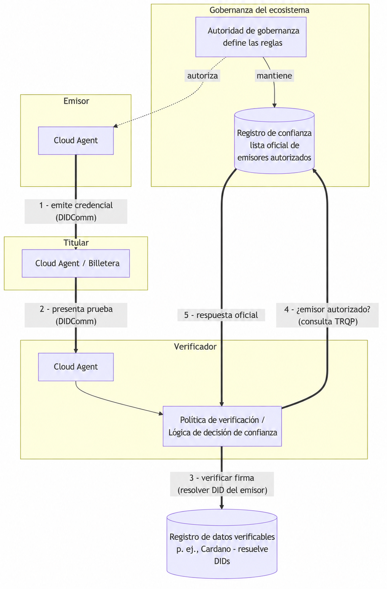

# Registros de confianza {#sec-trust-registries}

A lo largo del libro hemos seguido las credenciales entre tres roles: un emisor que firma la credencial, un titular que la almacena y presenta, y un verificador que la comprueba. La criptografía del [capítulo @sec-verification] responde a una pregunta precisa: *¿la clave que indica la credencial realmente la firmó, y alguien la ha alterado?* Es una garantía sólida, pero no cubre todo. Una firma válida solo indica al verificador que una clave firmó la credencial. No indica si debe creer a la entidad detrás de esa clave.

Considera un verificador que recibe una credencial de título universitario. La firma es correcta. Pero cualquiera puede instalar Identus Cloud Agent, crear un DID publicado y emitir una credencial que afirme ser un título de esa universidad. La criptografía de esa credencial falsificada es igual de válida. La diferencia entre el emisor real y el impostor es la *autoridad*: una comunidad reconoce a la universidad auténtica como entidad autorizada para emitir títulos. Un registro de confianza recoge esa autoridad y responde preguntas sobre ella.

## Qué es un registro de confianza

Un registro de confianza es una lista oficial legible por máquina que registra qué entidades tienen la confianza para desempeñar qué roles en una comunidad o *ecosistema* concreto. En su forma más simple responde a una pregunta como:

> ¿El DID `did:prism:abc…` tiene autorización para emitir una credencial de tipo `UniversityDegree` según las reglas de este ecosistema?

El registro acompaña a la verificación criptográfica. La verificación demuestra *quién firmó* la credencial. El registro de confianza demuestra *si ese firmante tiene reconocimiento* como autoridad para lo que afirma la credencial. El verificador necesita ambas respuestas antes de actuar con seguridad.

Conviene delimitar con precisión el registro de confianza. No es una autoridad de certificación y no emite ni conserva credenciales. No es una cadena de bloques ni un registro de datos verificables, aunque puede publicar sus datos en uno. Es una lista con gobernanza que mantiene el organismo que define las reglas del ecosistema, o alguien en su nombre. En el lenguaje de identidad autosoberana, ese organismo es la *autoridad de gobernanza* y el documento que describe las reglas es el *marco de gobernanza*. El registro de confianza expresa ese marco durante la ejecución y permite consultarlo.

Algunos ejemplos concretos ayudan a comprender la idea:

- Un ministerio nacional de educación mantiene un registro de universidades acreditadas que pueden emitir credenciales de títulos. Un verificador que comprueba un diploma pregunta al registro si el DID emisor pertenece a una institución acreditada.
- Un colegio farmacéutico mantiene un registro de farmacéuticos habilitados. Un sistema que dispensa medicamentos controlados pregunta si el DID del profesional que los presenta tiene habilitación vigente.
- Una autoridad aeronáutica mantiene un registro de organizaciones de mantenimiento aprobadas cuyos técnicos pueden firmar credenciales de aeronavegabilidad.

En cada caso se repite el patrón: una comunidad con reglas, un organismo que mantiene la lista y verificadores que la consultan al decidir.

::: {.callout-note}
Los registros de confianza aún son una parte emergente de SSI. Muchos sistemas de producción usan mecanismos más simples, como una lista fija de DIDs de emisores de confianza configurada directamente en el verificador. Identus refleja esta etapa: como vimos en el [capítulo @sec-verification], sus políticas de verificación contienen una lista `trustedIssuers` limitada a un esquema. Un registro de confianza generaliza esa idea en un servicio compartido, con gobernanza y consultas externas. Por ello, buena parte de lo que sigue describe arquitectura y perspectivas futuras, más que software ampliamente desplegado.
:::

## Posición del registro de confianza en la arquitectura

Para comprender un registro de confianza, observa cómo encaja entre los componentes que ya hemos construido. Es un servicio externo que el verificador consulta por separado del intercambio de credenciales. No forma parte de la conexión DIDComm entre titular y verificador, y normalmente el titular nunca lo usa.

El siguiente diagrama muestra un despliegue SSI con calidad de producción. El emisor, el titular y el verificador ejecutan cada uno un Identus Cloud Agent. Intercambian credenciales mediante DIDComm y usan mediadores cuando hace falta. Resuelven DIDs contra un registro de datos verificables. El registro de confianza permanece aparte y el verificador lo consulta cuando necesita decidir sobre la confianza.

Desde el punto de vista del verificador, el flujo es:

1. El emisor emite una credencial al titular mediante DIDComm, como describe el [capítulo @sec-verifiable-credentials].
2. Más adelante, el titular presenta una prueba al verificador mediante una conexión DIDComm existente.
3. El verificador verifica criptográficamente la presentación y resuelve el DID del emisor contra el registro de datos verificables para comprobar la firma.
4. El verificador pregunta al registro de confianza si el DID del emisor tiene autorización para emitir este tipo de credencial según el marco de gobernanza correspondiente.
5. El registro devuelve una respuesta oficial que el verificador incorpora a su decisión final de aceptar o rechazar.

Dos propiedades de este diseño importan. Primero, la consulta del registro ocurre *fuera de banda* respecto al intercambio de credenciales. Ocurre entre el verificador y el registro; el titular no participa y ni siquiera necesita saber qué registro consulta el verificador. Segundo, la verificación de confianza y la verificación de firma son pasos separados. Como señala el [capítulo @sec-verification], un despliegue que usa un registro externo debe separar su consulta de la verificación de pruebas: el verificador resuelve el conjunto de emisores de confianza para el esquema solicitado e incorpora ese resultado a su decisión de política. Una credencial puede ser criptográficamente perfecta y aun así recibir un rechazo porque su emisor no está en el registro.

## Trust Registry Query Protocol (TRQP) 2.0 de ToIP

Si cada ecosistema inventara su propia forma de exponer un registro de confianza, los verificadores necesitarían código de integración específico para cada comunidad. La Trust Over IP Foundation (ToIP), que presentamos en el [capítulo @sec-continuing-your-journey], aborda esto con **Trust Registry Query Protocol (TRQP)**. Su especificación 2.0 define una forma estándar de solo lectura para preguntar a un registro si una entidad tiene una autorización concreta en un ecosistema.

Una analogía útil de la especificación compara TRQP para registros de confianza con DNS para servidores de nombres: una capa de consulta ligera y universal que permite obtener respuestas oficiales sin conocer la implementación interna del registro. El protocolo se centra en dos tipos de preguntas:

- **Consultas de autorización**: *¿La entidad X tiene la autorización Y según el marco de gobernanza del ecosistema Z?* Es la pregunta de nuestro verificador: ¿puede este emisor emitir este tipo de credencial?
- **Consultas de reconocimiento**: *¿Este ecosistema reconoce a otro ecosistema o registro como autoridad?* Esto permite que comunidades distintas se reconozcan entre sí y que la confianza atraviese límites de organizaciones.

El protocolo estándar y mínimo permite que aplicaciones y organizaciones SSI distintas interoperen. Un verificador basado en Identus y un registro mantenido por otra organización pueden interactuar si ambos usan TRQP, sin adoptar las tecnologías de la otra parte. La especificación separa el protocolo básico de sus adaptaciones de transporte. La adaptación inicial define TRQP mediante HTTPS con una definición OpenAPI y deja espacio para adaptaciones futuras como DIDComm. TRQP es de solo lectura: consulta datos de confianza, pero nunca crea ni modifica el contenido del registro. La autoridad de gobernanza del ecosistema conserva la responsabilidad de añadir contenidos y gobernarlos.

Para obtener los detalles completos, incluidos el modelo de datos y la definición de API, consulta la especificación aprobada: [ToIP Trust Registry Query Protocol (TRQP) v2.0](https://trustoverip.github.io/tswg-trust-registry-protocol/approved/).

## Registros de confianza e Identus hoy

Identus no incluye un registro de confianza integrado y, en el momento de escribir este texto, muy pocos funcionan en producción. Identus proporciona los componentes donde incorporar la decisión de un registro. Como explica el [capítulo @sec-verification], la `verification policy` del verificador ya expresa un conjunto `trustedIssuers` limitado a `schemaId`. En un ecosistema maduro, un registro externo puede proporcionar ese conjunto: en lugar de fijar los DIDs de emisores de confianza en cada verificador, su controlador consulta un registro mediante TRQP, resuelve los emisores actualmente autorizados para el tipo de credencial y aplica el resultado a su decisión de política.

Esto mantiene una arquitectura clara y adaptable. Las comprobaciones criptográficas del verificador conservan su lugar. La decisión de confianza se convierte en una consulta separada que puede sustituirse. Puede comenzar como una lista estática durante el desarrollo y crecer hasta un registro con gobernanza que use TRQP a medida que madura el ecosistema de la aplicación.

::: {.callout-note}
Como los registros de confianza están en una etapa inicial de adopción, trata este capítulo como una guía de la dirección del ecosistema. Si construyes hoy, mantén aislada la lógica de decisión de confianza de la lógica de verificación, para que sustituir una lista estática de emisores por un registro real sea un cambio localizado.
:::
