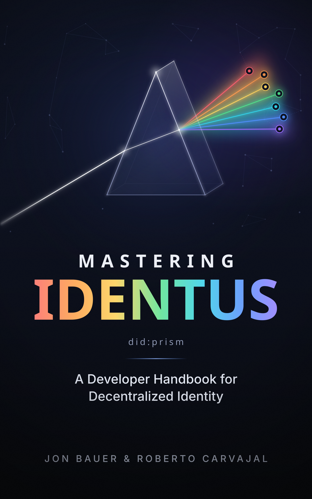

{fig-alt="The Mastering Identus book cover: a glass prism splits a beam of white light into seven colored rays that end in credential nodes, above the title Mastering Identus, the subtitle A Developer Handbook for Decentralized Identity, and the authors Jon Bauer and Roberto Carvajal." width=60%}

It's here! **Mastering Identus: A Developer Handbook for Decentralized Identity** is [now available in full](https://identusbook.com/book/).  

The book is also now available in Spanish!: [https://identusbook.com/book/es/](https://identusbook.com/book/es/)

The book remains open source, as well as the 3 Edge SDK example apps:

Book: [https://github.com/identusbook/identusbook.github.io](https://github.com/identusbook/identusbook.github.io)

TypeScript SDK Example: [https://github.com/identusbook/example-ts](https://github.com/identusbook/example-ts)

iOS Example: [https://github.com/identusbook/example-ios](https://github.com/identusbook/example-ios)

Android Example: [https://github.com/identusbook/example-android](https://github.com/identusbook/example-android)

If you spot any typos, errors, or have suggestions, please file an issue on the appropriate GitHub repository.

We hope this resource provides value to those learning Identus and the concepts of Decentralized Identity.

Thank you to the Cardano and Catalyst communities, as well as the hardworking Identus Maintainers team, this would not be possible without all of your tireless efforts.

Enjoy!

Jon and Roberto

