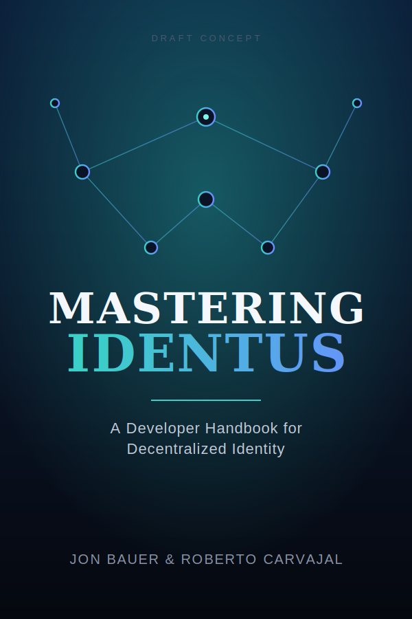
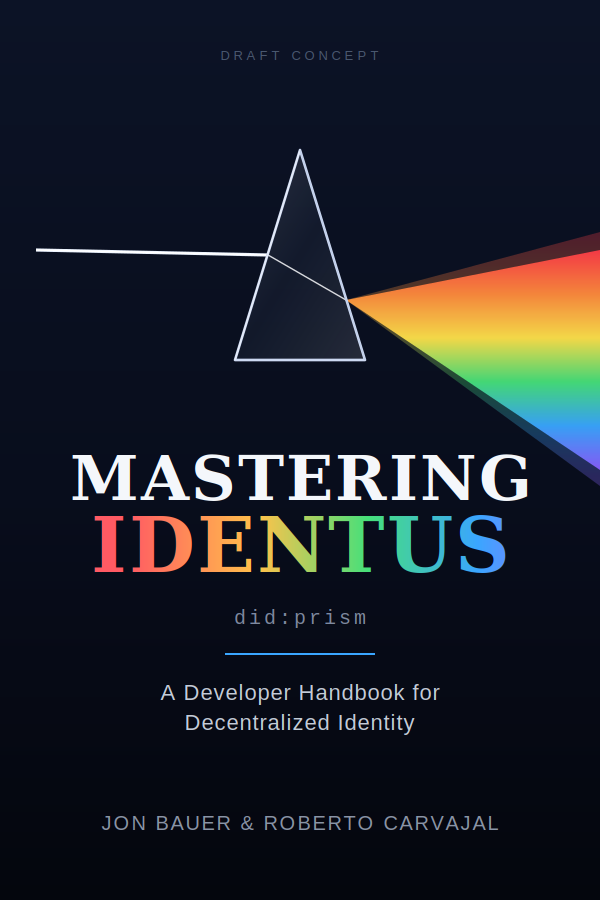

As part of our [Milestone 3](https://milestones.projectcatalyst.io/projects/1100192) commitments, we owe the community an update on who will create the graphic materials for the book.

Our commitment was specific: provide a written acceptance letter from the designer who will work on the design and graphic materials for the book, or, if we decide to use non-human AI resources, publish a post on the project's website explaining how we came to that decision and showing acceptable examples.

We've decided to go the AI route. With the recent advancements in Large Language Models, we've decided to use a combination of several AI models to create the illustrations, infographics, and the book cover. The quality is now strong enough to produce clear, consistent visuals, and working this way lets us iterate quickly and keep the look of the book aligned with its content as that content evolves.

To give a sense of the direction, here are two early cover concepts we've been exploring. These are draft placeholders, not the final art, but they show the kind of clean, consistent visuals the approach can produce.

::: {layout-ncol=2}
{width=100%}

{width=100%}
:::

We're back at work on the manuscript and expect to have it finalized in **September 2026**. A more detailed update on the book's progress, along with refined examples of the AI-generated artwork, will follow in our next post.

Thanks, as always, for your support.
